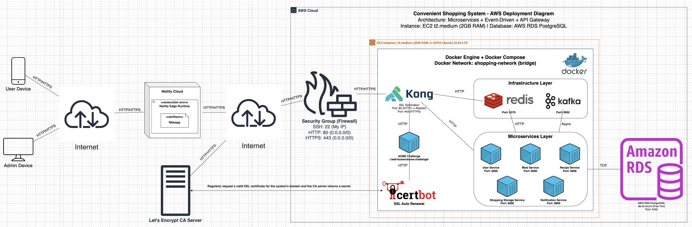

# Convenient Shopping System

> IT4990 - Software Design & Development – Hanoi University of Science and Technology

## General Information

The **Convenient Shopping System** is designed to address common household challenges in meal planning, grocery shopping, and food management. Many families struggle with inefficient shopping habits, food waste due to expired items, and difficulty coordinating household tasks among family members.

This system provides a comprehensive solution by helping users:
- Plan shopping trips more efficiently
- Track food inventory and expiration dates
- Reduce food waste through timely reminders
- Coordinate shopping responsibilities among family members
- Generate meal plans based on available ingredients

The project aims to promote sustainable consumption habits while ensuring proper nutrition and minimizing unnecessary expenses.


## System Architecture Overview



The system follows a **microservices architecture** with **event-driven communication** patterns:

- **Kong Gateway**: Serves as the API Gateway and entry point for all backend services, handling routing, authentication, and rate limiting.
- **Redis**: Implements caching layer using the cache-aside pattern to improve response times and reduce database load.
- **Kafka Broker**: Acts as the message broker enabling asynchronous communication between microservices.
- **Certbot**: Manages automatic SSL certificate renewal from Let's Encrypt, ensuring secure HTTPS connections.
- **Microservices**: Independent services (User, Recipe, Meal, Shopping Storage, Notification) that handle specific business domains.

## Video Demo


## Usage Guide

### Prerequisites

- Pull latest update on remote repository and navigate to the root directory. 
- Docker Desktop (Docker Engine) installed and running on your machine. 
- Set up local .venv directories for each service and load the packages specified in the `requirements.txt` file.
- Configure Environment Variables if the `.env.example` exists.
  ```bash
  cp .env.example .env
  cp user-service/.env.example user-service/.env
  cp meal-service/.env.example meal-service/.env
  cp recipe-service/.env.example recipe-service/.env
  cp shopping-storage-service/.env.example shopping-storage-service/.env
  cp notification-service/.env.example notification-service/.env
  ```
- Generate asymmetric RSA Key pair, private key for signing jwt token, public key for verifying token signature at Kong Gateway:
  ```bash
  cd user-service
  source .venv/bin/activate
  
  # Generate RSA keys pair
  python3 scripts/generate_rsa_keys.py
  
  # Verify RSA keys pair
  python3 scripts/verify_rsa_keys_pair.py
  ```

### Simulate Production Environment Locally

To test the production setup (with SSL, Kong Gateway, and Domain routing) on your local machine (Mac/Linux), follow these steps:

**1. Create Dummy SSL Certificates**

Create the system directory structure and generate self-signed certificates.

```bash
# Create directory (requires sudo)
sudo mkdir -p /etc/letsencrypt/live/dichotienloi.com/

# Generate self-signed certificate
sudo openssl req -x509 -nodes -days 365 -newkey rsa:2048 \
  -keyout /etc/letsencrypt/live/dichotienloi.com/privkey.pem \
  -out /etc/letsencrypt/live/dichotienloi.com/fullchain.pem \
  -subj "/CN=dichotienloi.com"

# Check after create certificate
sudo ls -l /etc/letsencrypt/live/dichotienloi.com/
```

**2. Copy Certificates to Project Folder (Fix Permission Issues)**

Docker on MacOS has trouble mounting system folders like `/etc`. We copy certs to a local `./certs` folder.

```bash
# Create local certs folder
mkdir -p certs

# Copy certs and change ownership to current user
sudo cp /etc/letsencrypt/live/dichotienloi.com/fullchain.pem ./certs/
sudo cp /etc/letsencrypt/live/dichotienloi.com/privkey.pem ./certs/
sudo chown $USER ./certs/*.pem
```

**3. Mock Domain Name**

Trick your computer into thinking `dichotienloi.com` is your localhost.

```bash
# Open hosts file
sudo nano /etc/hosts

# Add this line at the end:
127.0.0.1 dichotienloi.com

# Check after mock domain name
# Option 1: Check file hosts content
cat /etc/hosts | grep dichotienloi.com

# Option 2: Check by ping command
ping -c 3 dichotienloi.com
```

**4. Run Production Compose**

```bash
docker compose -f docker-compose.prod.yml up -d
```

**5. Verify**

Open your browser and visit: `https://dichotienloi.com`

- You will see a "Security Warning" (because it's a self-signed cert). Click "Advanced" -> "Proceed".
- If you see the API response or Kong welcome page, SSL Termination is working correctly!

> **Note:** The `certbot` service will fail in logs because it cannot connect to Let's Encrypt from localhost. This is expected and can be ignored during local testing.
