# Sequence Diagrams - Authentication & User Flows

Tài liệu này mô tả các luồng tương tác giữa các thành phần trong hệ thống (View, Service, Repository, Database, Redis, Kafka, Notification Service) cho các chức năng xác thực và quản lý người dùng/nhóm.

## 1. Luồng Đăng ký & Kích hoạt (Register & Activation)
Luồng này mô tả quá trình tạo tài khoản, gửi mã OTP qua Notification Service và người dùng xác thực để kích hoạt tài khoản.

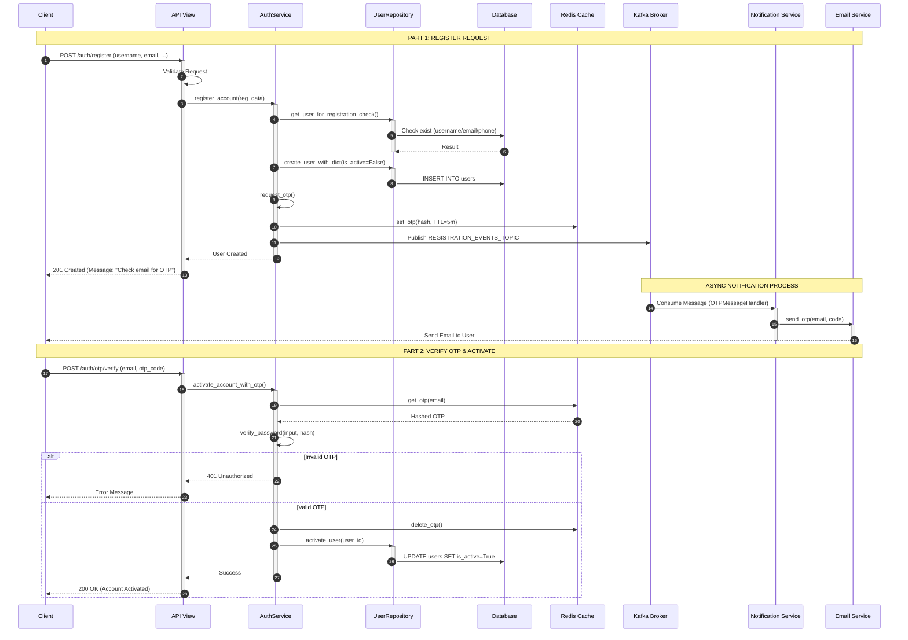
```mermaid
sequenceDiagram
    autonumber
    participant Client
    participant View as API View
    participant Service as AuthService
    participant Repo as UserRepository
    participant DB as Database
    participant Redis as Redis Cache
    participant Kafka as Kafka Broker
    participant NotiService as Notification Service
    participant Email as Email Service

    %% --- PHẦN 1: ĐĂNG KÝ ---
    note over Client, Email: PART 1: REGISTER REQUEST
    
    Client->>View: POST /auth/register (username, email, ...)
    activate View
    View->>View: Validate Request
    
    View->>Service: register_account(reg_data)
    activate Service
    
    %% Kiểm tra trùng lặp
    Service->>Repo: get_user_for_registration_check()
    activate Repo
    Repo->>DB: Check exist (username/email/phone)
    DB-->>Repo: Result
    deactivate Repo
    
    %% Tạo User (Inactive)
    Service->>Repo: create_user_with_dict(is_active=False)
    activate Repo
    Repo->>DB: INSERT INTO users
    deactivate Repo
    
    %% Xử lý OTP
    Service->>Service: request_otp()
    Service->>Redis: set_otp(hash, TTL=5m)
    
    %% Gửi sự kiện sang Notification Service
    Service->>Kafka: Publish REGISTRATION_EVENTS_TOPIC
    
    Service-->>View: User Created
    deactivate Service
    
    View-->>Client: 201 Created (Message: "Check email for OTP")
    deactivate View

    %% --- ASYNC: GỬI EMAIL ---
    note over Kafka, Email: ASYNC NOTIFICATION PROCESS
    
    Kafka->>NotiService: Consume Message (OTPMessageHandler)
    activate NotiService
    NotiService->>Email: send_otp(email, code)
    activate Email
    Email-->>Client: Send Email to User
    deactivate Email
    deactivate NotiService

    %% --- PHẦN 2: XÁC THỰC ---
    note over Client, Email: PART 2: VERIFY OTP & ACTIVATE
    
    Client->>View: POST /auth/otp/verify (email, otp_code)
    activate View
    
    View->>Service: activate_account_with_otp()
    activate Service
    
    %% Verify OTP
    Service->>Redis: get_otp(email)
    Redis-->>Service: Hashed OTP
    Service->>Service: verify_password(input, hash)
    
    alt Invalid OTP
        Service-->>View: 401 Unauthorized
        View-->>Client: Error Message
    else Valid OTP
        Service->>Redis: delete_otp()
        
        %% Kích hoạt tài khoản
        Service->>Repo: activate_user(user_id)
        activate Repo
        Repo->>DB: UPDATE users SET is_active=True
        deactivate Repo
        
        Service-->>View: Success
        deactivate Service
        
        View-->>Client: 200 OK (Account Activated)
    end
    deactivate View
```

---

## 2. Luồng Đăng nhập (Login)
Luồng này mô tả quá trình xác thực người dùng, cấp phát JWT (Access & Refresh Token) và quản lý phiên làm việc với Redis Allowlist.

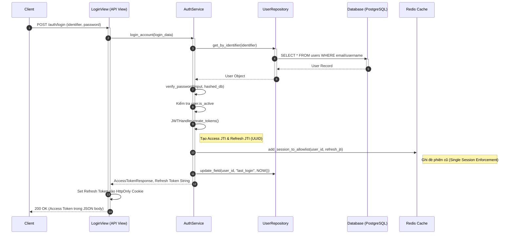
```mermaid
sequenceDiagram
    autonumber
    participant Client
    participant View as LoginView (API View)
    participant Service as AuthService
    participant Repo as UserRepository
    participant DB as Database (PostgreSQL)
    participant Redis as Redis Cache

    Client->>View: POST /auth/login (identifier, password)
    activate View
    
    View->>Service: login_account(login_data)
    activate Service
    
    %% Lấy thông tin user
    Service->>Repo: get_by_identifier(identifier)
    activate Repo
    Repo->>DB: SELECT * FROM users WHERE email/username
    activate DB
    DB-->>Repo: User Record
    deactivate DB
    Repo-->>Service: User Object
    deactivate Repo
    
    %% Xác thực
    Service->>Service: verify_password(input, hashed_db)
    Service->>Service: Kiểm tra user.is_active
    
    %% Tạo Token
    Service->>Service: JWTHandler.create_tokens()
    note right of Service: Tạo Access JTI & Refresh JTI (UUID)
    
    %% Quản lý Session
    Service->>Redis: add_session_to_allowlist(user_id, refresh_jti)
    note right of Redis: Ghi đè phiên cũ (Single Session Enforcement)
    
    %% Log login
    Service->>Repo: update_field(user_id, "last_login", NOW())
    
    Service-->>View: AccessTokenResponse, Refresh Token String
    deactivate Service
    
    View->>View: Set Refresh Token vào HttpOnly Cookie
    View-->>Client: 200 OK (Access Token trong JSON body)
    deactivate View
```

---

## 3. Luồng Đăng xuất (Logout)
Luồng đăng xuất thực hiện thu hồi cả Access Token (vào Blocklist) và Refresh Token (xóa khỏi Allowlist). Notification Service sẽ nhận sự kiện để ngắt kết nối WebSocket.

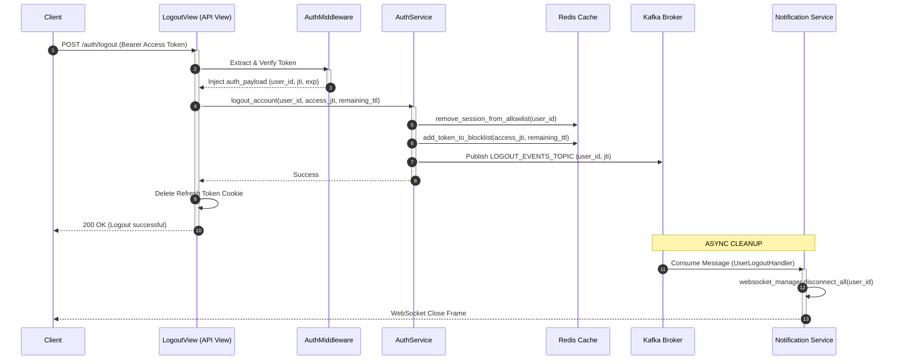
```mermaid
sequenceDiagram
    autonumber
    participant Client
    participant View as LogoutView (API View)
    participant Middleware as AuthMiddleware
    participant Service as AuthService
    participant Redis as Redis Cache
    participant Kafka as Kafka Broker
    participant NotiService as Notification Service

    Client->>View: POST /auth/logout (Bearer Access Token)
    activate View
    
    View->>Middleware: Extract & Verify Token
    activate Middleware
    Middleware-->>View: Inject auth_payload (user_id, jti, exp)
    deactivate Middleware
    
    View->>Service: logout_account(user_id, access_jti, remaining_ttl)
    activate Service
    
    %% Vô hiệu hóa Refresh Token
    Service->>Redis: remove_session_from_allowlist(user_id)
    
    %% Vô hiệu hóa Access Token
    Service->>Redis: add_token_to_blocklist(access_jti, remaining_ttl)
    
    %% Thông báo hệ thống
    Service->>Kafka: Publish LOGOUT_EVENTS_TOPIC (user_id, jti)
    
    Service-->>View: Success
    deactivate Service
    
    View->>View: Delete Refresh Token Cookie
    View-->>Client: 200 OK (Logout successful)
    deactivate View

    %% --- ASYNC: DISCONNECT WEBSOCKET ---
    note over Kafka, NotiService: ASYNC CLEANUP
    Kafka->>NotiService: Consume Message (UserLogoutHandler)
    activate NotiService
    NotiService->>NotiService: websocket_manager.disconnect_all(user_id)
    NotiService-->>Client: WebSocket Close Frame
    deactivate NotiService
```

---

## 4. Luồng Quên Mật Khẩu (Forgot Password)
Quy trình này gồm 2 bước chính: Yêu cầu OTP (Step 1) và Đặt lại mật khẩu (Step 2).

### Bước 1: Yêu cầu OTP (Request OTP)

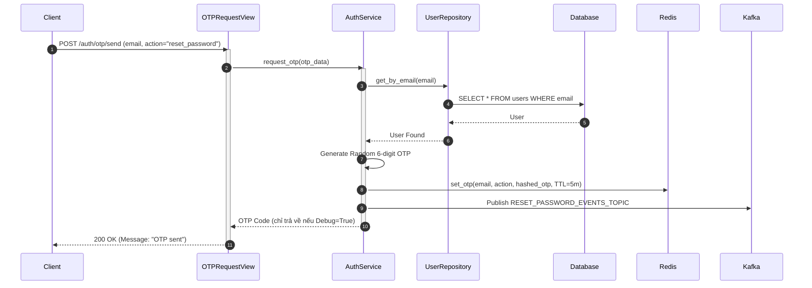
```mermaid
sequenceDiagram
    autonumber
    participant Client
    participant View as OTPRequestView
    participant Service as AuthService
    participant Repo as UserRepository
    participant DB as Database
    participant Redis as Redis
    participant Kafka as Kafka

    Client->>View: POST /auth/otp/send (email, action="reset_password")
    activate View
    
    View->>Service: request_otp(otp_data)
    activate Service
    
    %% Kiểm tra Email tồn tại
    Service->>Repo: get_by_email(email)
    Repo->>DB: SELECT * FROM users WHERE email
    DB-->>Repo: User
    Repo-->>Service: User Found
    
    %% Tạo và Lưu OTP
    Service->>Service: Generate Random 6-digit OTP
    Service->>Redis: set_otp(email, action, hashed_otp, TTL=5m)
    
    %% Gửi Email
    Service->>Kafka: Publish RESET_PASSWORD_EVENTS_TOPIC
    
    Service-->>View: OTP Code (chỉ trả về nếu Debug=True)
    deactivate Service
    
    View-->>Client: 200 OK (Message: "OTP sent")
    deactivate View
```

### Bước 2: Đặt lại mật khẩu (Reset Password)

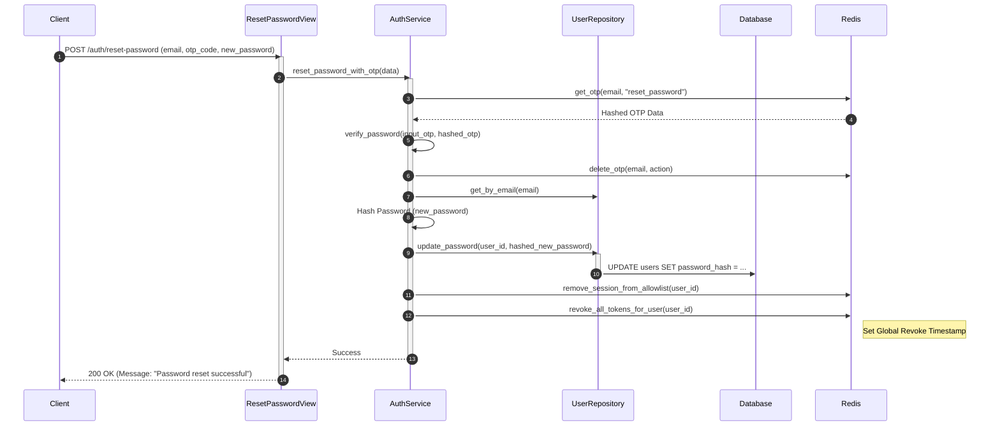
```mermaid
sequenceDiagram
    autonumber
    participant Client
    participant View as ResetPasswordView
    participant Service as AuthService
    participant Repo as UserRepository
    participant DB as Database
    participant Redis as Redis

    Client->>View: POST /auth/reset-password (email, otp_code, new_password)
    activate View
    
    View->>Service: reset_password_with_otp(data)
    activate Service
    
    %% Xác thực OTP
    Service->>Redis: get_otp(email, "reset_password")
    Redis-->>Service: Hashed OTP Data
    Service->>Service: verify_password(input_otp, hashed_otp)
    Service->>Redis: delete_otp(email, action)
    
    %% Cập nhật mật khẩu
    Service->>Repo: get_by_email(email)
    Service->>Service: Hash Password (new_password)
    Service->>Repo: update_password(user_id, hashed_new_password)
    activate Repo
    Repo->>DB: UPDATE users SET password_hash = ...
    deactivate Repo
    
    %% Bảo mật: Thu hồi tất cả phiên đăng nhập cũ
    Service->>Redis: remove_session_from_allowlist(user_id)
    Service->>Redis: revoke_all_tokens_for_user(user_id)
    note right of Redis: Set Global Revoke Timestamp
    
    Service-->>View: Success
    deactivate Service
    
    View-->>Client: 200 OK (Message: "Password reset successful")
    deactivate View
```

## 5. Luồng Làm mới Token (Refresh Token - Rotation)
Cho phép user lấy Access Token mới khi token cũ hết hạn mà không cần đăng nhập lại. Sử dụng cơ chế Rotation để tăng cường bảo mật (Refresh token cũng được đổi mới sau mỗi lần sử dụng).

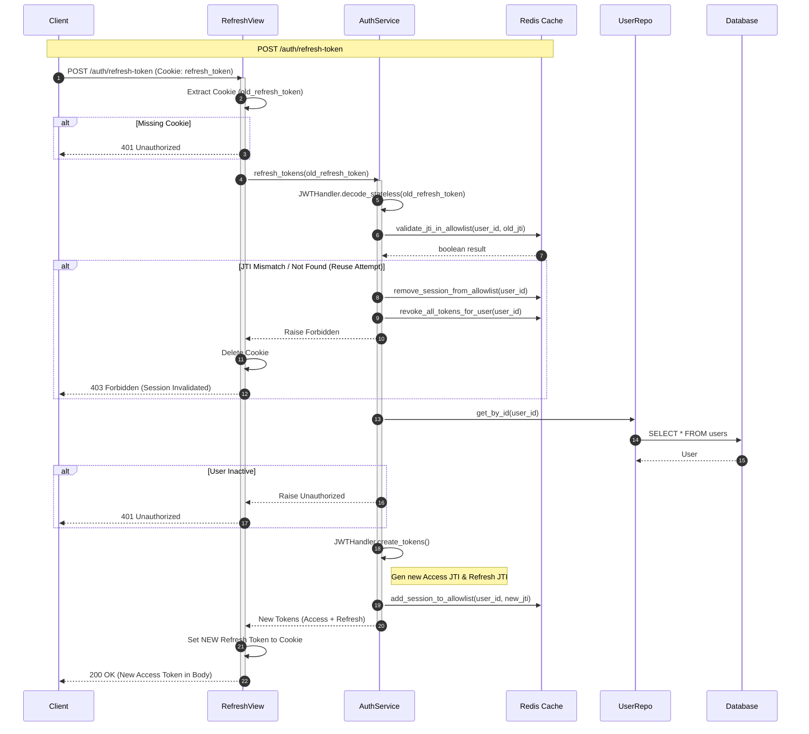
```mermaid
sequenceDiagram
    autonumber
    participant Client
    participant View as RefreshView
    participant Service as AuthService
    participant Redis as Redis Cache
    participant Repo as UserRepo
    participant DB as Database

    %% --- REQUEST REFRESH ---
    note over Client, Redis: POST /auth/refresh-token
    Client->>View: POST /auth/refresh-token (Cookie: refresh_token)
    activate View
    
    View->>View: Extract Cookie (old_refresh_token)
    alt Missing Cookie
        View-->>Client: 401 Unauthorized
    end
    
    View->>Service: refresh_tokens(old_refresh_token)
    activate Service
    
    %% Decode & Validate Stateless
    Service->>Service: JWTHandler.decode_stateless(old_refresh_token)
    
    %% Validate Stateful (Reuse Detection)
    Service->>Redis: validate_jti_in_allowlist(user_id, old_jti)
    Redis-->>Service: boolean result
    
    alt JTI Mismatch / Not Found (Reuse Attempt)
        %% Security Breach: Revoke everything
        Service->>Redis: remove_session_from_allowlist(user_id)
        Service->>Redis: revoke_all_tokens_for_user(user_id)
        Service-->>View: Raise Forbidden
        View->>View: Delete Cookie
        View-->>Client: 403 Forbidden (Session Invalidated)
    end
    
    %% Check User Status
    Service->>Repo: get_by_id(user_id)
    Repo->>DB: SELECT * FROM users
    DB-->>Repo: User
    alt User Inactive
        Service-->>View: Raise Unauthorized
        View-->>Client: 401 Unauthorized
    end
    
    %% Rotate Token: Create NEW pair
    Service->>Service: JWTHandler.create_tokens()
    note right of Service: Gen new Access JTI & Refresh JTI
    
    %% Update Session (Overwrite old JTI)
    Service->>Redis: add_session_to_allowlist(user_id, new_jti)
    
    Service-->>View: New Tokens (Access + Refresh)
    deactivate Service
    
    %% Response
    View->>View: Set NEW Refresh Token to Cookie
    View-->>Client: 200 OK (New Access Token in Body)
    deactivate View
```

---

## 6. Luồng Quản lý Nhóm Gia đình (Family Group)

### 6.1. Tạo Nhóm (Create Group)
Người dùng tạo nhóm sẽ tự động trở thành `HEAD_CHEF`. Hệ thống cập nhật tags của user vì đã tham gia nhóm mới.

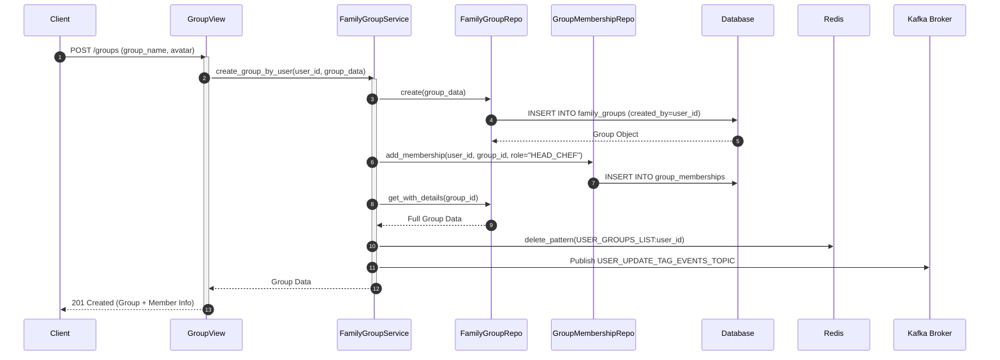
```mermaid
sequenceDiagram
    autonumber
    participant Client
    participant View as GroupView
    participant Service as FamilyGroupService
    participant RepoGroup as FamilyGroupRepo
    participant RepoMember as GroupMembershipRepo
    participant DB as Database
    participant Redis as Redis
    participant Kafka as Kafka Broker

    Client->>View: POST /groups (group_name, avatar)
    activate View
    
    View->>Service: create_group_by_user(user_id, group_data)
    activate Service
    
    %% Create Group
    Service->>RepoGroup: create(group_data)
    RepoGroup->>DB: INSERT INTO family_groups (created_by=user_id)
    DB-->>RepoGroup: Group Object
    
    %% Add Creator as Head Chef
    Service->>RepoMember: add_membership(user_id, group_id, role="HEAD_CHEF")
    RepoMember->>DB: INSERT INTO group_memberships
    
    %% Fetch Full Details
    Service->>RepoGroup: get_with_details(group_id)
    RepoGroup-->>Service: Full Group Data
    
    %% Invalidate Cache
    Service->>Redis: delete_pattern(USER_GROUPS_LIST:user_id)
    
    %% Publish User Tag Update (User joined new group)
    Service->>Kafka: Publish USER_UPDATE_TAG_EVENTS_TOPIC
    
    Service-->>View: Group Data
    deactivate Service
    
    View-->>Client: 201 Created (Group + Member Info)
    deactivate View
```

### 6.2. Thêm Thành viên (Add Member)
Chỉ `HEAD_CHEF` mới có quyền thêm thành viên. Hệ thống gửi thông báo cho cả nhóm và thông báo riêng cho thành viên mới.

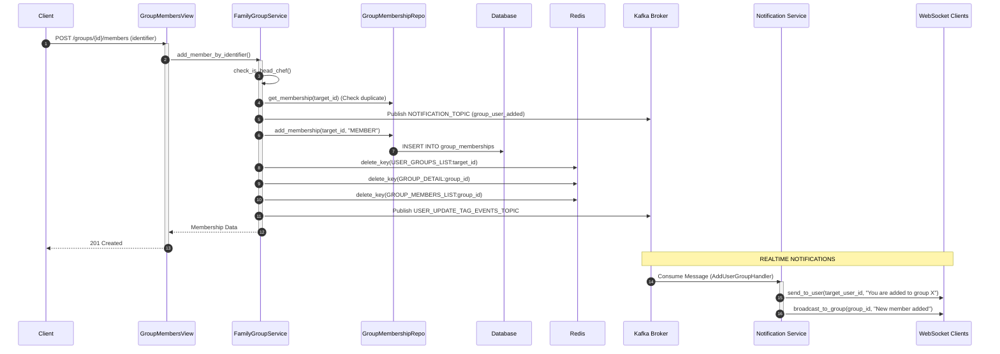
```mermaid
sequenceDiagram
    autonumber
    participant Client
    participant View as GroupMembersView
    participant Service as FamilyGroupService
    participant RepoMember as GroupMembershipRepo
    participant DB as Database
    participant Redis as Redis
    participant Kafka as Kafka Broker
    participant NotiService as Notification Service
    participant WS as WebSocket Clients

    Client->>View: POST /groups/{id}/members (identifier)
    activate View
    
    View->>Service: add_member_by_identifier()
    activate Service
    
    %% Check Permissions & Existence
    Service->>Service: check_is_head_chef()
    Service->>RepoMember: get_membership(target_id) (Check duplicate)
    
    %% Publish Notification Event (Prior to DB insert to notify early/async)
    Service->>Kafka: Publish NOTIFICATION_TOPIC (group_user_added)
    
    %% Add Membership
    Service->>RepoMember: add_membership(target_id, "MEMBER")
    RepoMember->>DB: INSERT INTO group_memberships
    
    %% Invalidate Caches
    Service->>Redis: delete_key(USER_GROUPS_LIST:target_id)
    Service->>Redis: delete_key(GROUP_DETAIL:group_id)
    Service->>Redis: delete_key(GROUP_MEMBERS_LIST:group_id)
    
    %% Publish User Tag Update (Target user joined group)
    Service->>Kafka: Publish USER_UPDATE_TAG_EVENTS_TOPIC
    
    Service-->>View: Membership Data
    deactivate Service
    View-->>Client: 201 Created
    deactivate View

    %% --- ASYNC NOTIFICATIONS ---
    note over Kafka, WS: REALTIME NOTIFICATIONS
    Kafka->>NotiService: Consume Message (AddUserGroupHandler)
    activate NotiService
    
    %% 1. Thông báo cho thành viên mới (User Channel)
    NotiService->>WS: send_to_user(target_user_id, "You are added to group X")
    
    %% 2. Thông báo cho cả nhóm (Group Channel)
    NotiService->>WS: broadcast_to_group(group_id, "New member added")
    deactivate NotiService
```

### 6.3. Chuyển quyền Head Chef (Transfer Role)
`HEAD_CHEF` chuyển quyền cho thành viên khác. Thông báo realtime được gửi tới cả nhóm.

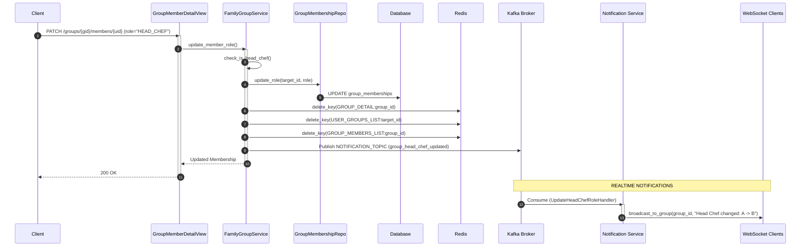
```mermaid
sequenceDiagram
    autonumber
    participant Client
    participant View as GroupMemberDetailView
    participant Service as FamilyGroupService
    participant RepoMember as GroupMembershipRepo
    participant DB as Database
    participant Redis as Redis
    participant Kafka as Kafka Broker
    participant NotiService as Notification Service
    participant WS as WebSocket Clients

    Client->>View: PATCH /groups/{gid}/members/{uid} (role="HEAD_CHEF")
    activate View
    
    View->>Service: update_member_role()
    activate Service
    
    %% Check Permission
    Service->>Service: check_is_head_chef()
    
    %% Update DB
    Service->>RepoMember: update_role(target_id, role)
    RepoMember->>DB: UPDATE group_memberships
    
    %% Invalidate Caches
    Service->>Redis: delete_key(GROUP_DETAIL:group_id)
    Service->>Redis: delete_key(USER_GROUPS_LIST:target_id)
    Service->>Redis: delete_key(GROUP_MEMBERS_LIST:group_id)
    
    %% Publish Notification Event
    Service->>Kafka: Publish NOTIFICATION_TOPIC (group_head_chef_updated)
    
    Service-->>View: Updated Membership
    deactivate Service
    View-->>Client: 200 OK
    deactivate View

    %% --- ASYNC NOTIFICATIONS ---
    note over Kafka, WS: REALTIME NOTIFICATIONS
    Kafka->>NotiService: Consume (UpdateHeadChefRoleHandler)
    activate NotiService
    NotiService->>WS: broadcast_to_group(group_id, "Head Chef changed: A -> B")
    deactivate NotiService
```

### 6.4. Xóa Thành viên (Remove Member / Kick)
`HEAD_CHEF` xóa thành viên khỏi nhóm. Thông báo cho nhóm và người bị xóa.

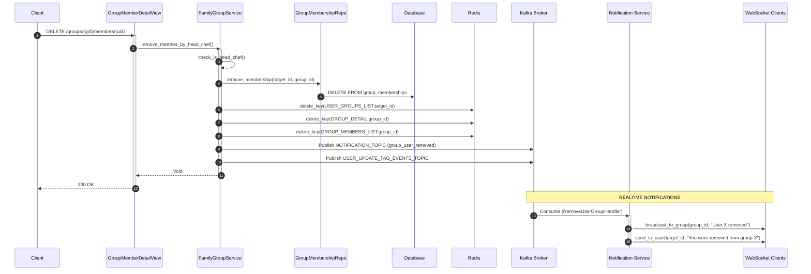
```mermaid
sequenceDiagram
    autonumber
    participant Client
    participant View as GroupMemberDetailView
    participant Service as FamilyGroupService
    participant RepoMember as GroupMembershipRepo
    participant DB as Database
    participant Redis as Redis
    participant Kafka as Kafka Broker
    participant NotiService as Notification Service
    participant WS as WebSocket Clients

    Client->>View: DELETE /groups/{gid}/members/{uid}
    activate View
    
    View->>Service: remove_member_by_head_chef()
    activate Service
    
    %% Check Permissions
    Service->>Service: check_is_head_chef()
    
    %% Remove from DB
    Service->>RepoMember: remove_membership(target_id, group_id)
    RepoMember->>DB: DELETE FROM group_memberships
    
    %% Invalidate Caches
    Service->>Redis: delete_key(USER_GROUPS_LIST:target_id)
    Service->>Redis: delete_key(GROUP_DETAIL:group_id)
    Service->>Redis: delete_key(GROUP_MEMBERS_LIST:group_id)
    
    %% Publish Notification Event
    Service->>Kafka: Publish NOTIFICATION_TOPIC (group_user_removed)
    
    %% Publish User Tag Update (Target user left group)
    Service->>Kafka: Publish USER_UPDATE_TAG_EVENTS_TOPIC
    
    Service-->>View: Void
    deactivate Service
    View-->>Client: 200 OK
    deactivate View

    %% --- ASYNC NOTIFICATIONS ---
    note over Kafka, WS: REALTIME NOTIFICATIONS
    Kafka->>NotiService: Consume (RemoveUserGroupHandler)
    activate NotiService
    
    %% 1. Thông báo cho nhóm (Người này đã bị xóa)
    NotiService->>WS: broadcast_to_group(group_id, "User X removed")
    
    %% 2. Thông báo riêng cho người bị xóa
    NotiService->>WS: send_to_user(target_id, "You were removed from group X")
    deactivate NotiService
```

### 6.5. Rời Nhóm (Leave Group)
Thành viên tự rời khỏi nhóm. Nếu là Head Chef và còn thành viên khác, quyền Head Chef sẽ được chuyển trước.

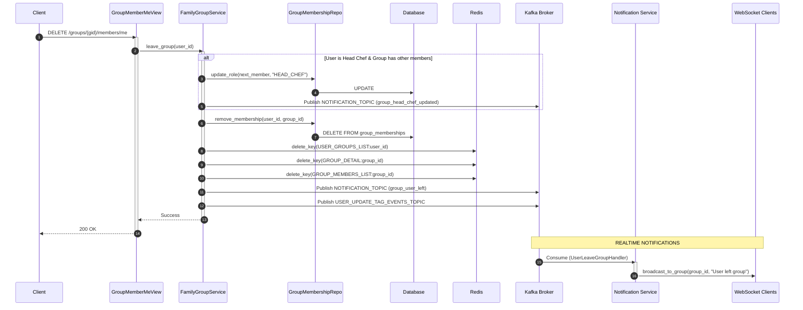
```mermaid
sequenceDiagram
    autonumber
    participant Client
    participant View as GroupMemberMeView
    participant Service as FamilyGroupService
    participant RepoMember as GroupMembershipRepo
    participant DB as Database
    participant Redis as Redis
    participant Kafka as Kafka Broker
    participant NotiService as Notification Service
    participant WS as WebSocket Clients

    Client->>View: DELETE /groups/{gid}/members/me
    activate View
    
    View->>Service: leave_group(user_id)
    activate Service
    
    %% Logic kiểm tra & Chuyển quyền nếu là Head Chef
    alt User is Head Chef & Group has other members
        Service->>RepoMember: update_role(next_member, "HEAD_CHEF")
        RepoMember->>DB: UPDATE
        Service->>Kafka: Publish NOTIFICATION_TOPIC (group_head_chef_updated)
    end
    
    %% Remove Membership
    Service->>RepoMember: remove_membership(user_id, group_id)
    RepoMember->>DB: DELETE FROM group_memberships
    
    %% Invalidate Caches
    Service->>Redis: delete_key(USER_GROUPS_LIST:user_id)
    Service->>Redis: delete_key(GROUP_DETAIL:group_id)
    Service->>Redis: delete_key(GROUP_MEMBERS_LIST:group_id)
    
    %% Publish Notification Event
    Service->>Kafka: Publish NOTIFICATION_TOPIC (group_user_left)
    
    %% Publish User Tag Update
    Service->>Kafka: Publish USER_UPDATE_TAG_EVENTS_TOPIC
    
    Service-->>View: Success
    deactivate Service
    View-->>Client: 200 OK
    deactivate View

    %% --- ASYNC NOTIFICATIONS ---
    note over Kafka, WS: REALTIME NOTIFICATIONS
    Kafka->>NotiService: Consume (UserLeaveGroupHandler)
    activate NotiService
    NotiService->>WS: broadcast_to_group(group_id, "User left group")
    deactivate NotiService
```

---

## 7. Quản lý Thông tin Cá nhân (User Profile Management)

### 7.1. Xem & Cập nhật Thông tin Cơ bản (Core Info)
Bao gồm các thông tin như `username`, `first_name`, `last_name`, `phone_num`, `avatar_url`.

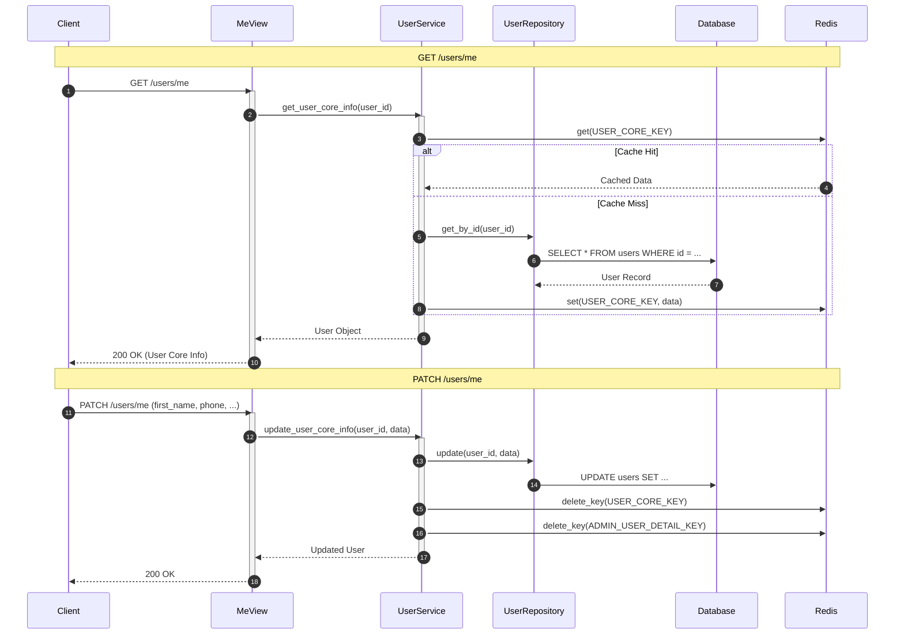
```mermaid
sequenceDiagram
    autonumber
    participant Client
    participant View as MeView
    participant Service as UserService
    participant Repo as UserRepository
    participant DB as Database
    participant Redis as Redis

    %% --- GET CORE INFO ---
    note over Client, Redis: GET /users/me
    Client->>View: GET /users/me
    activate View
    View->>Service: get_user_core_info(user_id)
    activate Service
    
    %% Check Cache
    Service->>Redis: get(USER_CORE_KEY)
    alt Cache Hit
        Redis-->>Service: Cached Data
    else Cache Miss
        Service->>Repo: get_by_id(user_id)
        Repo->>DB: SELECT * FROM users WHERE id = ...
        DB-->>Repo: User Record
        Service->>Redis: set(USER_CORE_KEY, data)
    end
    
    Service-->>View: User Object
    deactivate Service
    View-->>Client: 200 OK (User Core Info)
    deactivate View

    %% --- UPDATE CORE INFO ---
    note over Client, Redis: PATCH /users/me
    Client->>View: PATCH /users/me (first_name, phone, ...)
    activate View
    
    View->>Service: update_user_core_info(user_id, data)
    activate Service
    
    Service->>Repo: update(user_id, data)
    Repo->>DB: UPDATE users SET ...
    
    %% Invalidate Cache
    Service->>Redis: delete_key(USER_CORE_KEY)
    Service->>Redis: delete_key(ADMIN_USER_DETAIL_KEY)
    
    Service-->>View: Updated User
    deactivate Service
    View-->>Client: 200 OK
    deactivate View
```

### 7.2. Xem & Cập nhật Hồ sơ Chi tiết (Identity & Health)
Bao gồm `Identity Profile` (CCCD, Giới tính...) và `Health Profile` (Chiều cao, cân nặng...).
Logic tương tự nhau cho cả 2 loại hồ sơ: nếu chưa có thì tạo mặc định.

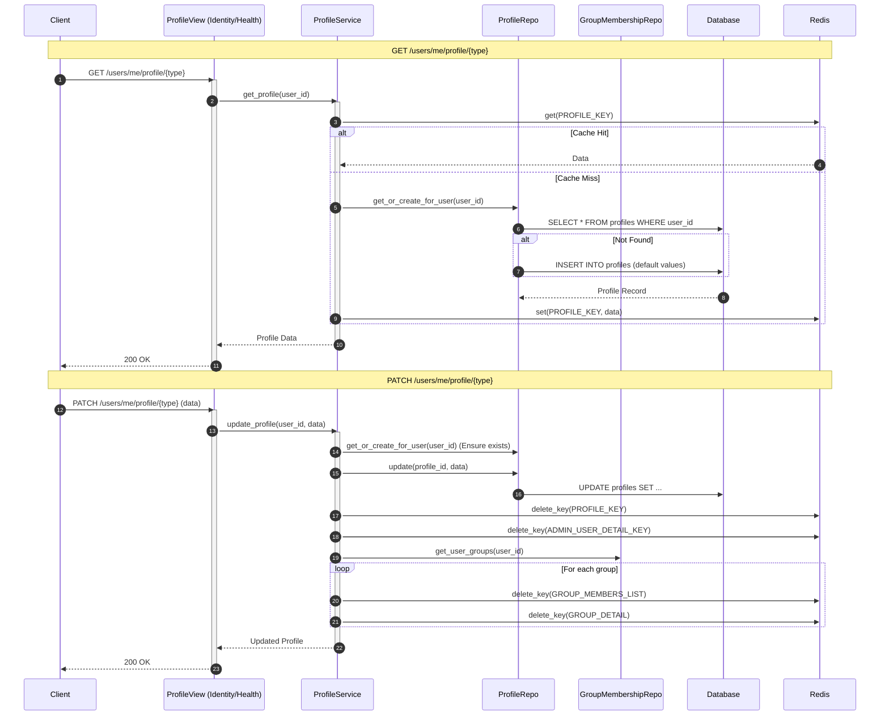
```mermaid
sequenceDiagram
    autonumber
    participant Client
    participant View as ProfileView (Identity/Health)
    participant Service as ProfileService
    participant Repo as ProfileRepo
    participant GroupRepo as GroupMembershipRepo
    participant DB as Database
    participant Redis as Redis

    %% --- GET PROFILE ---
    note over Client, Redis: GET /users/me/profile/{type}
    
    Client->>View: GET /users/me/profile/{type}
    activate View
    View->>Service: get_profile(user_id)
    activate Service
    
    %% Check Cache
    Service->>Redis: get(PROFILE_KEY)
    alt Cache Hit
        Redis-->>Service: Data
    else Cache Miss
        %% Get or Create Default
        Service->>Repo: get_or_create_for_user(user_id)
        Repo->>DB: SELECT * FROM profiles WHERE user_id
        alt Not Found
            Repo->>DB: INSERT INTO profiles (default values)
        end
        DB-->>Repo: Profile Record
        Service->>Redis: set(PROFILE_KEY, data)
    end
    
    Service-->>View: Profile Data
    deactivate Service
    View-->>Client: 200 OK
    deactivate View

    %% --- UPDATE PROFILE ---
    note over Client, Redis: PATCH /users/me/profile/{type}
    Client->>View: PATCH /users/me/profile/{type} (data)
    activate View
    View->>Service: update_profile(user_id, data)
    activate Service
    
    Service->>Repo: get_or_create_for_user(user_id) (Ensure exists)
    Service->>Repo: update(profile_id, data)
    Repo->>DB: UPDATE profiles SET ...
    
    %% Invalidate Caches
    Service->>Redis: delete_key(PROFILE_KEY)
    Service->>Redis: delete_key(ADMIN_USER_DETAIL_KEY)
    
    %% Invalidate Group Caches (Vì thông tin thành viên thay đổi)
    Service->>GroupRepo: get_user_groups(user_id)
    loop For each group
        Service->>Redis: delete_key(GROUP_MEMBERS_LIST)
        Service->>Redis: delete_key(GROUP_DETAIL)
    end
    
    Service-->>View: Updated Profile
    deactivate Service
    View-->>Client: 200 OK
    deactivate View
```

---

## 8. Đổi Mật khẩu (Change Password)
Yêu cầu xác thực mật khẩu cũ trước khi đổi. Sau khi đổi thành công, hệ thống sẽ thu hồi tất cả các token hiện hành (Logout all devices).

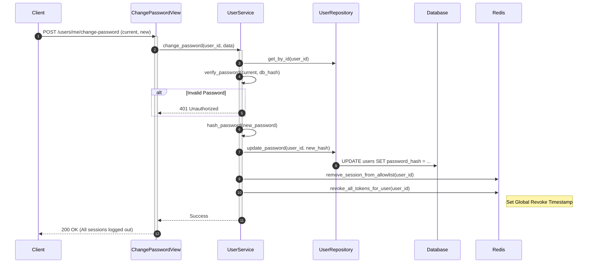
```mermaid
sequenceDiagram
    autonumber
    participant Client
    participant View as ChangePasswordView
    participant Service as UserService
    participant Repo as UserRepository
    participant DB as Database
    participant Redis as Redis

    Client->>View: POST /users/me/change-password (current, new)
    activate View
    
    View->>Service: change_password(user_id, data)
    activate Service
    
    %% Verify Old Password
    Service->>Repo: get_by_id(user_id)
    Service->>Service: verify_password(current, db_hash)
    alt Invalid Password
        Service-->>View: 401 Unauthorized
    end
    
    %% Update New Password
    Service->>Service: hash_password(new_password)
    Service->>Repo: update_password(user_id, new_hash)
    Repo->>DB: UPDATE users SET password_hash = ...
    
    %% Security: Revoke All Sessions
    Service->>Redis: remove_session_from_allowlist(user_id)
    Service->>Redis: revoke_all_tokens_for_user(user_id)
    note right of Redis: Set Global Revoke Timestamp
    
    Service-->>View: Success
    deactivate Service
    View-->>Client: 200 OK (All sessions logged out)
    deactivate View
```

---

## 9. Đổi Email (Change Email)
Quy trình bảo mật 2 bước: Gửi OTP đến email **mới** để xác minh quyền sở hữu, sau đó mới cập nhật vào DB.

### Bước 1: Yêu cầu đổi Email (Request Change)

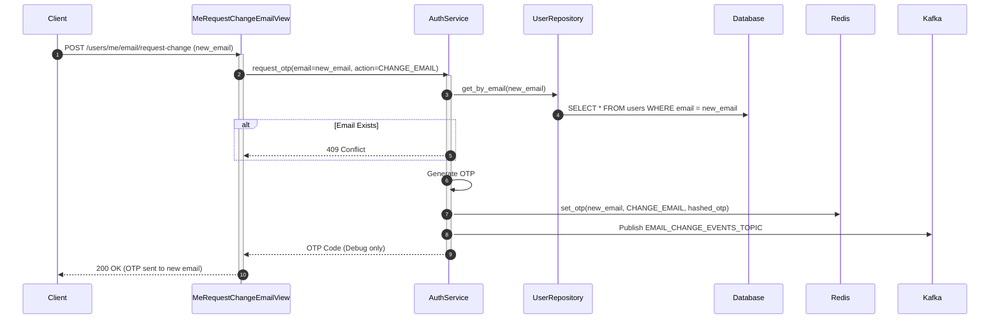
```mermaid
sequenceDiagram
    autonumber
    participant Client
    participant View as MeRequestChangeEmailView
    participant Service as AuthService
    participant Repo as UserRepository
    participant DB as Database
    participant Redis as Redis
    participant Kafka as Kafka

    Client->>View: POST /users/me/email/request-change (new_email)
    activate View
    
    View->>Service: request_otp(email=new_email, action=CHANGE_EMAIL)
    activate Service
    
    %% Check Conflict (Email mới đã tồn tại chưa?)
    Service->>Repo: get_by_email(new_email)
    Repo->>DB: SELECT * FROM users WHERE email = new_email
    alt Email Exists
        Service-->>View: 409 Conflict
    end
    
    %% Gen & Store OTP
    Service->>Service: Generate OTP
    Service->>Redis: set_otp(new_email, CHANGE_EMAIL, hashed_otp)
    
    %% Send Email via Kafka
    Service->>Kafka: Publish EMAIL_CHANGE_EVENTS_TOPIC
    
    Service-->>View: OTP Code (Debug only)
    deactivate Service
    View-->>Client: 200 OK (OTP sent to new email)
    deactivate View
```

### Bước 2: Xác nhận đổi Email (Confirm Change)

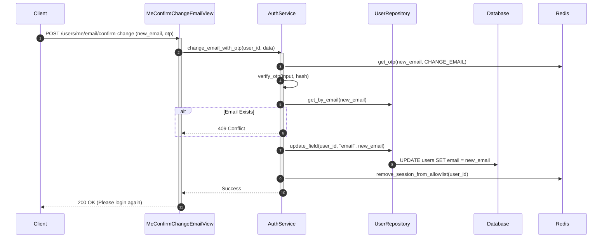
```mermaid
sequenceDiagram
    autonumber
    participant Client
    participant View as MeConfirmChangeEmailView
    participant Service as AuthService
    participant Repo as UserRepository
    participant DB as Database
    participant Redis as Redis

    Client->>View: POST /users/me/email/confirm-change (new_email, otp)
    activate View
    
    View->>Service: change_email_with_otp(user_id, data)
    activate Service
    
    %% Verify OTP
    Service->>Redis: get_otp(new_email, CHANGE_EMAIL)
    Service->>Service: verify_otp(input, hash)
    
    %% Double Check Conflict
    Service->>Repo: get_by_email(new_email)
    alt Email Exists
        Service-->>View: 409 Conflict
    end
    
    %% Update DB
    Service->>Repo: update_field(user_id, "email", new_email)
    Repo->>DB: UPDATE users SET email = new_email
    
    %% Revoke Session (Optional but recommended)
    Service->>Redis: remove_session_from_allowlist(user_id)
    
    Service-->>View: Success
    deactivate Service
    View-->>Client: 200 OK (Please login again)
    deactivate View
```

---

## 10. Admin - Quản lý Người dùng (Admin User Management)

### 10.1. Lấy danh sách & Chi tiết User (List & Detail)
Admin có thể xem danh sách toàn bộ user (có phân trang) và xem chi tiết profile của một user cụ thể.

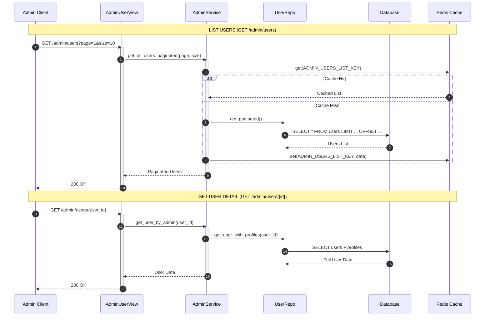
```mermaid
sequenceDiagram
    autonumber
    participant Admin as Admin Client
    participant View as AdminUserView
    participant Service as AdminService
    participant Repo as UserRepo
    participant DB as Database
    participant Redis as Redis Cache

    %% --- LIST USERS ---
    note over Admin, Redis: LIST USERS (GET /admin/users)
    Admin->>View: GET /admin/users?page=1&size=10
    activate View
    
    View->>Service: get_all_users_paginated(page, size)
    activate Service
    
    Service->>Redis: get(ADMIN_USERS_LIST_KEY)
    alt Cache Hit
        Redis-->>Service: Cached List
    else Cache Miss
        Service->>Repo: get_paginated()
        Repo->>DB: SELECT * FROM users LIMIT ... OFFSET ...
        DB-->>Repo: Users List
        Service->>Redis: set(ADMIN_USERS_LIST_KEY, data)
    end
    
    Service-->>View: Paginated Users
    deactivate Service
    View-->>Admin: 200 OK
    deactivate View

    %% --- GET USER DETAIL ---
    note over Admin, Redis: GET USER DETAIL (GET /admin/users/{id})
    Admin->>View: GET /admin/users/{user_id}
    activate View
    
    View->>Service: get_user_by_admin(user_id)
    activate Service
    
    Service->>Repo: get_user_with_profiles(user_id)
    Repo->>DB: SELECT users + profiles
    DB-->>Repo: Full User Data
    
    Service-->>View: User Data
    deactivate Service
    View-->>Admin: 200 OK
    deactivate View
```

### 10.2. Tạo, Cập nhật & Xóa User (Create, Update, Delete)
Admin có toàn quyền quản lý user. Các thao tác ghi sẽ invalid cache liên quan.

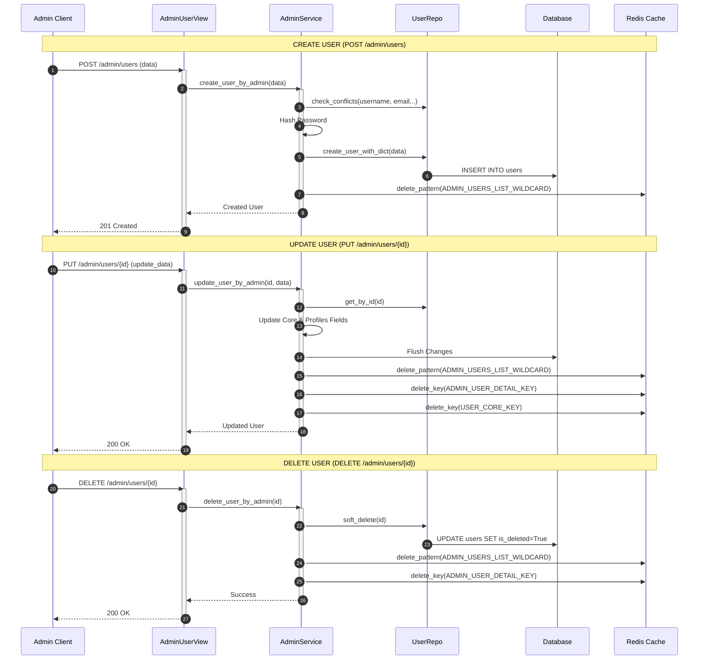
```mermaid
sequenceDiagram
    autonumber
    participant Admin as Admin Client
    participant View as AdminUserView
    participant Service as AdminService
    participant Repo as UserRepo
    participant DB as Database
    participant Redis as Redis Cache

    %% --- CREATE USER ---
    note over Admin, Redis: CREATE USER (POST /admin/users)
    Admin->>View: POST /admin/users (data)
    activate View
    
    View->>Service: create_user_by_admin(data)
    activate Service
    
    Service->>Repo: check_conflicts(username, email...)
    Service->>Service: Hash Password
    Service->>Repo: create_user_with_dict(data)
    Repo->>DB: INSERT INTO users
    
    %% Invalidate List Cache
    Service->>Redis: delete_pattern(ADMIN_USERS_LIST_WILDCARD)
    
    Service-->>View: Created User
    deactivate Service
    View-->>Admin: 201 Created
    deactivate View

    %% --- UPDATE USER ---
    note over Admin, Redis: UPDATE USER (PUT /admin/users/{id})
    Admin->>View: PUT /admin/users/{id} (update_data)
    activate View
    
    View->>Service: update_user_by_admin(id, data)
    activate Service
    
    Service->>Repo: get_by_id(id)
    Service->>Service: Update Core & Profiles Fields
    Service->>DB: Flush Changes
    
    %% Invalidate Caches
    Service->>Redis: delete_pattern(ADMIN_USERS_LIST_WILDCARD)
    Service->>Redis: delete_key(ADMIN_USER_DETAIL_KEY)
    Service->>Redis: delete_key(USER_CORE_KEY)
    
    Service-->>View: Updated User
    deactivate Service
    View-->>Admin: 200 OK
    deactivate View

    %% --- DELETE USER ---
    note over Admin, Redis: DELETE USER (DELETE /admin/users/{id})
    Admin->>View: DELETE /admin/users/{id}
    activate View
    
    View->>Service: delete_user_by_admin(id)
    activate Service
    
    Service->>Repo: soft_delete(id)
    Repo->>DB: UPDATE users SET is_deleted=True
    
    %% Invalidate Caches
    Service->>Redis: delete_pattern(ADMIN_USERS_LIST_WILDCARD)
    Service->>Redis: delete_key(ADMIN_USER_DETAIL_KEY)
    
    Service-->>View: Success
    deactivate Service
    View-->>Admin: 200 OK
    deactivate View
```

---

## 11. Admin - Quản lý Nhóm (Admin Group Management)

### 11.1. Quản lý Nhóm (Group CRUD)
Admin quản lý các nhóm gia đình tương tự như User nhưng không cần check quyền (Permission Check).

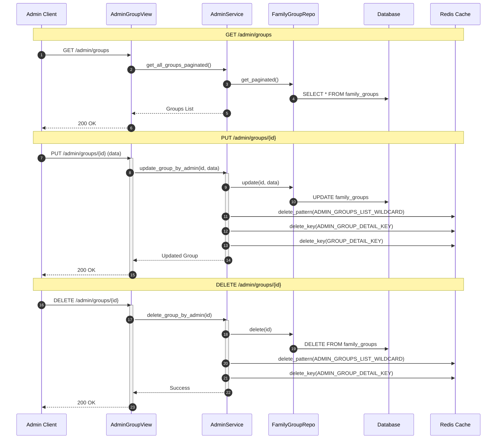
```mermaid
sequenceDiagram
    autonumber
    participant Admin as Admin Client
    participant View as AdminGroupView
    participant Service as AdminService
    participant Repo as FamilyGroupRepo
    participant DB as Database
    participant Redis as Redis Cache

    %% --- LIST GROUPS ---
    note over Admin, Redis: GET /admin/groups
    Admin->>View: GET /admin/groups
    View->>Service: get_all_groups_paginated()
    Service->>Repo: get_paginated()
    Repo->>DB: SELECT * FROM family_groups
    Service-->>View: Groups List
    View-->>Admin: 200 OK

    %% --- UPDATE GROUP ---
    note over Admin, Redis: PUT /admin/groups/{id}
    Admin->>View: PUT /admin/groups/{id} (data)
    activate View
    
    View->>Service: update_group_by_admin(id, data)
    activate Service
    
    Service->>Repo: update(id, data)
    Repo->>DB: UPDATE family_groups
    
    %% Invalidate Caches
    Service->>Redis: delete_pattern(ADMIN_GROUPS_LIST_WILDCARD)
    Service->>Redis: delete_key(ADMIN_GROUP_DETAIL_KEY)
    Service->>Redis: delete_key(GROUP_DETAIL_KEY)
    
    Service-->>View: Updated Group
    deactivate Service
    View-->>Admin: 200 OK
    deactivate View

    %% --- DELETE GROUP ---
    note over Admin, Redis: DELETE /admin/groups/{id}
    Admin->>View: DELETE /admin/groups/{id}
    activate View
    
    View->>Service: delete_group_by_admin(id)
    activate Service
    
    Service->>Repo: delete(id)
    Repo->>DB: DELETE FROM family_groups
    
    %% Invalidate Caches
    Service->>Redis: delete_pattern(ADMIN_GROUPS_LIST_WILDCARD)
    Service->>Redis: delete_key(ADMIN_GROUP_DETAIL_KEY)
    
    Service-->>View: Success
    deactivate Service
    View-->>Admin: 200 OK
    deactivate View
```

### 11.2. Quản lý Thành viên Nhóm (Group Members Management)
Admin có thể can thiệp trực tiếp vào thành viên của nhóm: Thêm, Xóa, Đổi quyền mà không cần là HEAD_CHEF.

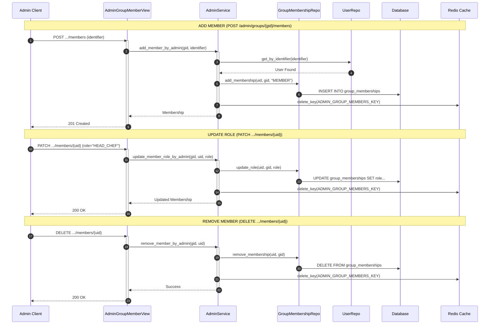
```mermaid
sequenceDiagram
    autonumber
    participant Admin as Admin Client
    participant View as AdminGroupMemberView
    participant Service as AdminService
    participant Repo as GroupMembershipRepo
    participant UserRepo as UserRepo
    participant DB as Database
    participant Redis as Redis Cache

    %% --- ADD MEMBER ---
    note over Admin, Redis: ADD MEMBER (POST /admin/groups/{gid}/members)
    Admin->>View: POST .../members (identifier)
    activate View
    
    View->>Service: add_member_by_admin(gid, identifier)
    activate Service
    
    Service->>UserRepo: get_by_identifier(identifier)
    UserRepo-->>Service: User Found
    
    Service->>Repo: add_membership(uid, gid, "MEMBER")
    Repo->>DB: INSERT INTO group_memberships
    
    %% Invalidate Cache
    Service->>Redis: delete_key(ADMIN_GROUP_MEMBERS_KEY)
    
    Service-->>View: Membership
    deactivate Service
    View-->>Admin: 201 Created
    deactivate View

    %% --- UPDATE ROLE ---
    note over Admin, Redis: UPDATE ROLE (PATCH .../members/{uid})
    Admin->>View: PATCH .../members/{uid} (role="HEAD_CHEF")
    activate View
    
    View->>Service: update_member_role_by_admin(gid, uid, role)
    activate Service
    
    Service->>Repo: update_role(uid, gid, role)
    Repo->>DB: UPDATE group_memberships SET role...
    
    Service->>Redis: delete_key(ADMIN_GROUP_MEMBERS_KEY)
    
    Service-->>View: Updated Membership
    deactivate Service
    View-->>Admin: 200 OK
    deactivate View

    %% --- REMOVE MEMBER ---
    note over Admin, Redis: REMOVE MEMBER (DELETE .../members/{uid})
    Admin->>View: DELETE .../members/{uid}
    activate View
    
    View->>Service: remove_member_by_admin(gid, uid)
    activate Service
    
    Service->>Repo: remove_membership(uid, gid)
    Repo->>DB: DELETE FROM group_memberships
    
    Service->>Redis: delete_key(ADMIN_GROUP_MEMBERS_KEY)
    
    Service-->>View: Success
    deactivate Service
    View-->>Admin: 200 OK
    deactivate View
```

---