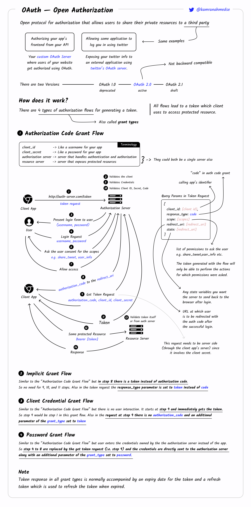

# BACKEND API HANDBOOK

## Mục lục

1.  [Các cơ chế xác thực](#1-các-cơ-chế-xác-thực)
    * [1.1. Phân biệt Authentication vs. Authorization](#11-phân-biệt-authentication-vs-authorization)
    * [1.2. Basic Authentication](#12-basic-authentication)
    * [1.3. Session-based Authentication](#13-session-based-authentication)
    * [1.4. Token-based Authentication & JSON Web Tokens (JWT)](#14-token-based-authentication--json-web-tokens-jwt)
    * [1.5. OAuth 2.0 - Giao thức phân quyền](#15-oauth-20---giao-thức-phân-quyền)
    * [1.6. Single Sign-On (SSO)](#16-single-sign-on-sso)
    * [1.7. Kết luận về cơ chế xác thực](#17-kết-luận-về-cơ-chế-xác-thực)
2.  [Nền tảng bảo mật Web và API theo chuẩn OWASP](#2-nền-tảng-bảo-mật-web-và-api-theo-chuẩn-owasp)
    * [2.1. Giới thiệu về OWASP](#21-giới-thiệu-về-owasp)
    * [2.2. Phân tích chi tiết OWASP API Security Top 10 (phiên bản 2023)](#22-phân-tích-chi-tiết-owasp-api-security-top-10-phiên-bản-2023)
        * [2.2.1. API1:2023 - Broken Object Level Authorization (BOLA)](#221-api12023---broken-object-level-authorization-bola)
        * [2.2.2. API2:2023 - Broken Authentication](#222-api22023---broken-authentication)
        * [2.2.3. API3:2023 - Broken Object Property Level Authorization](#223-api32023---broken-object-property-level-authorization)
        * [2.2.4. API4:2023 - Unrestricted Resource Consumption](#224-api42023---unrestricted-resource-consumption)
        * [2.2.5. API5:2023 - Broken Function Level Authorization (BFLA)](#225-api52023---broken-function-level-authorization-bfla)
        * [2.2.6. API6:2023 - Unrestricted Access to Sensitive Business Flows](#226-api62023---unrestricted-access-to-sensitive-business-flows)
        * [2.2.7. API7:2023 - Server Side Request Forgery (SSRF)](#227-api72023---server-side-request-forgery-ssrf)
        * [2.2.8. API8:2023 - Security Misconfiguration](#228-api82023---security-misconfiguration)
        * [2.2.9. API9:2023 - Improper Inventory Management](#229-api92023---improper-inventory-management)
        * [2.2.10. API10:2023 - Unsafe Consumption of APIs](#2210-api102023---unsafe-consumption-of-apis)
    * [2.3. Nhận xét về sự thay đổi trong OWASP API Security Top 10](#23-nhận-xét-về-sự-thay-đổi-trong-owasp-api-security-top-10)
    * [2.4. Áp dụng OWASP Web Checklist vào quy trình phát triển](#24-áp-dụng-owasp-web-checklist-vào-quy-trình-phát-triển)
    * [2.5. Tầm quan trọng của HTTPS](#25-tầm-quan-trọng-của-https)
3.  [Các hàm băm (Hashing Functions) và lưu trữ mật khẩu an toàn](#3-các-hàm-băm-hashing-functions-và-lưu-trữ-mật-khẩu-an-toàn)
    * [3.1. Nguyên tắc cơ bản của Hashing](#31-nguyên-tắc-cơ-bản-của-hashing)
    * [3.2. Tại sao MD5 và SHA-1 không còn an toàn](#32-tại-sao-md5-và-sha-1-không-còn-an-toàn)
    * [3.3. Phân tích các thuật toán hiện đại: bcrypt, scrypt và Argon2](#33-phân-tích-các-thuật-toán-hiện-đại-bcrypt-scrypt-và-argon2)
    * [3.4. Sự tiến hóa của thuật toán băm mật khẩu](#34-sự-tiến-hóa-của-thuật-toán-băm-mật-khẩu)
    * [3.5. Khuyến nghị thực tiễn](#35-khuyến-nghị-thực-tiễn)
4.  [Tổng hợp các API Security Best Practices](#4-tổng-hợp-các-api-security-best-practices)
    * [4.1. Bảo mật đường truyền với SSL/TLS](#41-bảo-mật-đường-truyền-với-ssltls)
    * [4.2. CORS (Cross-Origin Resource Sharing)](#42-cors-cross-origin-resource-sharing)
    * [4.3. CSP (Content Security Policy)](#43-csp-content-security-policy)
    * [4.4. Cứng hóa máy chủ và ứng dụng](#44-cứng-hóa-máy-chủ-và-ứng-dụng)
    * [4.5. Checklist Bảo mật API Toàn diện](#45-checklist-bảo-mật-api-toàn-diện)
5.  [Các loại tấn công phổ biến](#5-các-loại-tấn-công-phổ-biến)
    * [5.1. CSRF (Cross-Site Request Forgery)](#51-csrf-cross-site-request-forgery)
    * [5.2. XSS (Cross-Site Scripting)](#52-xss-cross-site-scripting)
    * [5.3. DoS (Denial of Service)](#53-dos-denial-of-service)
    * [5.4. Man-in-the-Middle (MitM)](#54-man-in-the-middle-mitm)
6.  [Kết luận](#kết-luận)

## 1. Các cơ chế xác thực

### 1.1. Phân biệt Authentication vs. Authorization

Phân biệt rõ hai khái niệm:

- **Authentication (Xác thực)**: Là quá trình xác minh danh tính của một người dùng hoặc dịch vụ. Nó trả lời câu hỏi: "Bạn là ai?". Ví dụ: Nhập username và password để chứng minh bạn là chủ sở hữu của tài khoản đó.
- **Authorization (Ủy quyền)**: Là quá trình xác định quyền truy cập và hành động mà người dùng đã được xác thực được phép thực hiện. Nó trả lời câu hỏi: "Bạn được phép làm gì?". Ví dụ: Người dùng thông thường có thể xem bài viết, còn admin có thể xóa bài viết.

**Lưu ý quan trọng**: Xác thực luôn diễn ra trước phân quyền, bạn không thể cấp quyền cho thực thể mà bạn không biết danh tính.

### 1.2. Basic Authentication

Đây là hình thức xác thực đơn giản nhất được định nghĩa trong đặc tả HTTP.


**Luồng hoạt động**:

1. **Client yêu cầu**: Client cố gắng truy cập một tài nguyên được bảo vệ.
2. **Server thách thức**: Server phản hồi với mã trạng thái `401 Unauthorized` và một header `WWW-Authenticate: Basic realm="tên vùng được bảo vệ"`.
3. **Client gửi thông tin**: Trình duyệt hiển thị một hộp thoại yêu cầu username và password. Sau khi người dùng đăng nhập, client tạo một chuỗi `username:password`, mã hóa nó bằng Base64, và gửi lại yêu cầu với header `Authorization: Basic <credentials_base64>`.
4. **Server xác minh**: Server giải mã chuỗi Base64 và kiểm tra thông tin đăng nhập. Nếu hợp lệ, server trả về tài nguyên được yêu cầu.

**Lỗ hổng và hạn chế**:

- **Không mã hóa**: Base64 là một thuật toán encoding, không phải encryption. Bất kỳ ai chặn được yêu cầu đều có thể dễ dàng giải mã và đọc được username và password. Do đó, việc sử dụng Basic Authentication bắt buộc phải đi kèm với HTTPS để mã hóa toàn bộ kênh truyền.
- **Nguy cơ CSRF (Cross-Site Request Forgery)**: Trình duyệt sẽ tự động gửi header `Authorization` trong mọi yêu cầu đến domain đó, khiến nó dễ bị tấn công CSRF.
- **Không có cơ chế Logout**: HTTP không cung cấp cách để server yêu cầu client đăng xuất hoặc xóa thông tin đăng nhập đã lưu trong bộ nhớ đệm.

**Trường hợp sử dụng**: Chỉ nên dùng cho các API nội bộ, các dịch vụ không quan trọng hoặc trong môi trường mà sự đơn giản được ưu tiên và HTTPS được thực thi nghiêm ngặt.

### 1.3. Session-based Authentication

Đây là phương pháp xác thực stateful (có trạng thái) truyền thống, đã từng là tiêu chuẩn cho các ứng dụng web nhiều năm.

**Luồng hoạt động**:

1. **Đăng nhập**: Người dùng gửi username và password.
2. **Tạo session**: Server xác thực thông tin. Nếu thành công, server tạo ra một bản ghi session duy nhất (lưu trữ thông tin người dùng) và lưu nó vào bộ nhớ hoặc cơ sở dữ liệu. Server cũng tạo ra một `session_id` ngẫu nhiên và duy nhất để định danh bản ghi này.
3. **Gửi Cookie**: Server gửi `session_id` này về cho client, thường được lưu trữ trong một cookie.
4. **Các yêu cầu tiếp theo**: Với mỗi yêu cầu sau đó đến cùng một server, trình duyệt sẽ tự động đính kèm cookie chứa `session_id`.
5. **Xác minh session**: Server nhận `session_id`, tìm kiếm bản ghi session tương ứng trong cơ sở dữ liệu của mình để xác định danh tính người dùng và trạng thái của họ.
6. **Đăng xuất**: Khi người dùng đăng xuất, server sẽ hủy bản ghi session trong cơ sở dữ liệu.

**Ưu điểm**:

- **Kiểm soát hoàn toàn server**: Vì trạng thái được lưu trên server, quản trị viên có thể dễ dàng vô hiệu hóa một session bất kỳ lúc nào (ví dụ: khi phát hiện hoạt động đáng ngờ).
- **Đơn giản cho client**: Client chỉ cần lưu một cookie, trình duyệt sẽ tự động quản lý việc gửi nó.

**Nhược điểm**:

- **Vấn đề về khả năng mở rộng**: Trong một hệ thống phân tán nhiều server, việc duy trì và đồng bộ hóa trạng thái session trở thành một thách thức lớn. Nếu một yêu cầu của người dùng được chuyển đến một server không chứa bản ghi session của họ, việc xác thực sẽ thất bại. Điều này dẫn đến các giải pháp phức tạp như "sticky session" (yêu cầu của một người dùng luôn được chuyển đến cùng một server) hoặc một kho lưu trữ session tập trung như Redis, làm tăng độ phức tạp của kiến trúc.
- **Tốn tài nguyên server**: Mỗi session đều chiếm một phần bộ nhớ hoặc dung lượng lưu trữ trên server.
- **Dễ bị tấn công CSRF**: Giống như Basic Auth, việc dựa vào cookie tự động gửi đi khiến nó dễ bị tấn công CSRF.

### 1.4. Token-based Authentication & JSON Web Tokens (JWT)

Để giải quyết các vấn đề về khả năng mở rộng của xác thực dựa trên session, phương pháp xác thực stateless (phi trạng thái) dựa trên token đã ra đời và trở nên phổ biến, đặc biệt là với sự xuất hiện của JWT.


**Luồng hoạt động (stateless)**:

1. **Đăng nhập**: Người dùng gửi username và password.
2. **Tạo token**: Server xác thực thông tin. Nếu thành công, server sẽ tạo ra một chuỗi token (thường là JWT) được ký bằng một khóa bí mật (secret key). Token này chứa thông tin (claims) về người dùng (ví dụ: `userID`, vai trò, thời gian hết hạn).
3. **Gửi token**: Server gửi token này cho client.
4. **Lưu trữ token**: Client lưu trữ token này, thường là trong Local Storage, Session Storage hoặc bộ nhớ (ví dụ: biến Javascript).
5. **Các yêu cầu tiếp theo**: Với mỗi yêu cầu đến một tài nguyên được bảo vệ, client phải đính kèm token vào header `Authorization` theo định dạng `Bearer <token>`.
6. **Xác minh Token**: Server nhận được token, kiểm tra chữ ký của nó bằng khóa bí mật đã lưu. Nếu chữ ký hợp lệ, server tin tưởng vào các thông tin chứa trong token và xử lý yêu cầu. Quá trình này không cần truy vấn cơ sở dữ liệu để tìm kiếm session, do đó nó là "stateless".

**Phân tích sâu về JWT (JSON Web Token)**:

Một JWT bao gồm ba phần được phân tách bởi dấu chấm `(.)`, mỗi phần được mã hóa Base64Url:

1. **Header**: Chứa metadata về token, bao gồm loại token (`type: "JWT"`) và thuật toán ký được sử dụng (`alg`: ví dụ `"HS256"` hoặc `"RS256"`).

2. **Payload**: Chứa các "claims" (tuyên bố) về thực thể. Có ba loại claims:
   - **Registered Claims**: Các claim được định nghĩa sẵn, không bắt buộc nhưng được khuyến nghị sử dụng, ví dụ: `iss` (issuer - người phát hành), `exp` (expiration time - thời gian hết hạn), `sub` (subject - chủ thể), `aud` (audience - đối tượng).
   - **Public Claims**: Các claim được định nghĩa bởi các bên sử dụng JWT, nhưng để tránh xung đột, chúng nên được đăng ký trong IANA JSON Web Token Registry.
   - **Private Claims**: Các claim tùy chỉnh được tạo ra để chia sẻ thông tin giữa các bên đã thống nhất với nhau.

3. **Signature**: Được tạo bằng cách ký phần header đã mã hóa, phần payload đã mã hóa, cùng với một khóa bí mật (đối với thuật toán đối xứng như HS256) hoặc khóa riêng tư (đối với thuật toán bất đối xứng như RS256). Chữ ký này đảm bảo token không bị thay đổi trên đường truyền.

**Validation vs. Verification**:

- **Validation (Kiểm tra tính hợp lệ)**: Là việc kiểm tra các claims trong payload. Ví dụ: kiểm tra xem token đã hết hạn chưa (dựa trên claim `exp`), hoặc nó sử dụng cho đúng đối tượng không (dựa trên claim `aud`).
- **Verification (Xác minh)**: Là việc kiểm tra chữ ký để đảm bảo tính toàn vẹn (token không bị sửa đổi) và tính xác thực (token được ký bởi một nguồn đáng tin cậy).

**Best Practices**:

- **Lưu trữ an toàn**: Tránh lưu trữ JWT trong Local Storage vì nó dễ bị tấn công XSS. Các lựa chọn an toàn hơn bao gồm lưu trong bộ nhớ của ứng dụng (ví dụ: biến Javascript) và sử dụng cookie `HttpOnly` (kết hợp ưu điểm của hai phương pháp này).
- **Thời gian hết hạn ngắn**: Token nên có thời gian hết hạn ngắn (ví dụ: 15 phút) để giảm thiểu thiệt hại nếu bị đánh cắp. Sử dụng Refresh Token để lấy access token mới mà không cần người dùng đăng nhập lại.
- **Luôn sử dụng HTTPS**: Giống Basic Auth, việc gửi token qua HTTP không an toàn sẽ làm lộ token.

### 1.5. OAuth 2.0 - Giao thức phân quyền

OAuth 2.0 là một tiêu chuẩn công nghiệp cho việc ủy quyền. Nó không phải là một giao thức xác thực, mặc dù thường được sử dụng cùng với các giao thức xác thực như OpenID Connect. Mục đích chính của OAuth 2.0 là cho phép một ứng dụng bên thứ ba (client) có quyền truy cập hạn chế vào tài nguyên của người dùng trên một dịch vụ khác (resource server), mà không cần phải chia sẻ thông tin đăng nhập của người dùng.



**Các Grant Types (Luồng cấp phép) chính**:

OAuth 2.0 định nghĩa một số "grant types" cho các trường hợp sử dụng khác nhau:

1. **Authorization Code Flow**: Đây là luồng an toàn và phổ biến nhất cho các ứng dụng web truyền thống và ứng dụng di động.
   - Client chuyển hướng người dùng đến Authorization Server.
   - Người dùng đăng nhập và đồng ý cấp quyền cho client.
   - Authorization Server chuyển hướng người dùng trở lại client với một `authorization_code` tạm thời.
   - Client (từ phía backend, một cách an toàn) gửi `authorization_code` này cùng với `client_id` và `client_secret` của mình đến Authorization Server để đổi lấy một `access_token`.

2. **Implicit Flow (Legacy)**: Một luồng đơn giản hơn, trong đó `access_token` được trả về trực tiếp cho client (thường là trình duyệt) sau khi người dùng đồng ý. Luồng này hiện được coi là không an toàn và đã được thay thế bằng Authorization Code Flow với PKCE (Proof Key for Code Exchange) cho các ứng dụng trang đơn (SPA).

3. **Resource Owner Password Credentials Grant**: Client yêu cầu người dùng nhập username và password trực tiếp và gửi chúng đến Authorization Server để đổi lấy `access_token`. Luồng này phá vỡ nguyên tắc cơ bản của OAuth (không chia sẻ mật khẩu) và hiện đã bị loại bỏ khỏi các thực tiễn tốt nhất về bảo mật. Chỉ nên sử dụng cho các ứng dụng "first-party" đáng tin cậy hoặc các hệ thống cũ.

4. **Client Credentials Grant**: Được sử dụng cho giao tiếp máy-đến-máy (server-to-server), nơi không có sự tương tác của người dùng. Client xác thực bằng `client_id` và `client_secret` của mình để lấy `access_token`.

### 1.6. Single Sign-On (SSO)
**Single Sign-On (SSO)** là một cơ chế cho phép người dùng đăng nhập một lần bằng một bộ thông tin xác thực để truy cập vào nhiều ứng dụng độc lập. **SAML (Security Assertion Markup Language)** là một tiêu chuẩn mở dựa trên XML để trao đổi dữ liệu xác thực và phân quyền giữa các bên.


**Luồng hoạt động của SAML**:

Có ba bên tham gia chính:

- **Principal**: Người dùng.
- **Identity Provider (IdP)**: Hệ thống quản lý danh tính, chịu trách nhiệm xác thực người dùng (ví dụ: Google, Okta, Azure AD).
- **Service Provider (SP)**: Ứng dụng hoặc dịch vụ mà người dùng muốn truy cập (ví dụ: Salesforce, Slack).

Luồng hoạt động (thường là SP-initiated) diễn ra như sau:

1. Người dùng cố gắng truy cập vào SP.
2. SP nhận thấy người dùng chưa được xác thực, nó tạo ra một yêu cầu xác thực SAML và chuyển hướng trình duyệt của người dùng đến IdP.
3. IdP yêu cầu người dùng đăng nhập (nếu họ chưa đăng nhập).
4. Sau khi xác thực thành công, IdP tạo ra một **SAML Assertion** (một tài liệu XML được ký điện tử, chứa thông tin về người dùng và các quyền của họ) và gửi nó trở lại trình duyệt của người dùng.
5. Trình duyệt gửi SAML Assertion này đến SP.
6. SP xác minh chữ ký của SAML Assertion (sử dụng chứng chỉ công khai của IdP), phân tích thông tin và cấp quyền truy cập cho người dùng.

### 1.7. Kết luận về cơ chế xác thực

Việc lựa chọn cơ chế xác thực là một quyết định kiến trúc nền tảng, quyết định khả năng mở rộng, tình trạng bảo mật và trải nghiệm người dùng của ứng dụng. Có một sự đánh đổi rõ ràng, bao trùm trong ngành: **kiểm soát phía máy chủ so với khả năng mở rộng phía máy khách**.

Xác thực dựa trên session tập trung trạng thái trên máy chủ, cho phép quản trị viên kiểm soát tuyệt đối—họ có thể vô hiệu hóa bất kỳ session nào ngay lập tức. Tuy nhiên, sự tập trung này tạo ra một nút thắt cổ chai về hiệu suất và khả năng mở rộng, đặc biệt trong kiến trúc microservices nơi các session cần được chia sẻ.

Xác thực dựa trên token (JWT) giải quyết vấn đề này bằng cách chuyển trạng thái sang phía client trong một token có thể xác minh, làm cho nó trở nên phi trạng thái và có khả năng mở rộng cao. Tuy nhiên, giải pháp này lại tạo ra một vấn đề mới: máy chủ mất khả năng thu hồi token ngay lập tức; một token bị đánh cắp vẫn hợp lệ cho đến khi hết hạn. Điều này buộc các nhà phát triển phải thực hiện các giải pháp phức tạp như danh sách thu hồi, vốn lại đưa một dạng trạng thái trở lại.

Do đó, không có giải pháp nào là hoàn hảo. Lựa chọn giữa session và token là một quyết định chiến lược dựa trên nhu cầu cụ thể: một ứng dụng ngân hàng bảo mật cao có thể ưu tiên khả năng thu hồi tức thì của session, trong khi một nền tảng mạng xã hội quy mô lớn sẽ ưu tiên khả năng mở rộng phi trạng thái của token.

**Bảng so sánh Session vs. Token**:

<table>
  <thead>
    <tr>
      <th>Tính năng</th>
      <th>Xác thực dựa trên Session</th>
      <th>Xác thực dựa trên Token (JWT)</th>
    </tr>
  </thead>
  <tbody>
    <tr>
      <td><strong>Quản lý Trạng thái</strong></td>
      <td>Stateful (Có trạng thái): Server lưu trữ bản ghi session cho mỗi người dùng đang hoạt động.</td>
      <td>Stateless (Phi trạng thái): Server không lưu trữ trạng thái. Mọi thông tin cần thiết đều nằm trong token.</td>
    </tr>
    <tr>
      <td><strong>Khả năng mở rộng</strong></td>
      <td>Kém: Khó mở rộng theo chiều ngang. Yêu cầu "sticky sessions" hoặc kho lưu trữ session tập trung.</td>
      <td>Tốt: Dễ dàng mở rộng vì không có trạng thái session cần đồng bộ hóa giữa các server.</td>
    </tr>
    <tr>
      <td><strong>Hiệu suất</strong></td>
      <td>Chậm hơn: Yêu cầu một lượt tra cứu (lookup) trong cơ sở dữ liệu/bộ nhớ đệm trên mỗi yêu cầu.</td>
      <td>Nhanh hơn: Chỉ cần xác minh chữ ký bằng CPU, không cần tra cứu I/O.</td>
    </tr>
    <tr>
      <td><strong>Bảo mật (CSRF)</strong></td>
      <td>Dễ bị tấn công: Phụ thuộc vào cookie, vốn dễ bị tấn công CSRF nếu không có các biện pháp phòng chống (SameSite, CSRF token).</td>
      <td>Ít bị ảnh hưởng hơn: Không phụ thuộc vào cookie tự động gửi đi, nhưng vẫn cần phòng chống nếu token được lưu trong cookie.</td>
    </tr>
    <tr>
      <td><strong>Bảo mật (XSS/Trộm cắp)</strong></td>
      <td>An toàn hơn (nếu dùng HttpOnly): Cookie <code>HttpOnly</code> không thể bị truy cập bởi JavaScript, giúp chống lại việc đánh cắp session qua XSS.</td>
      <td>Dễ bị tấn công: Nếu token được lưu trong <code>localStorage</code>, nó có thể bị đánh cắp qua tấn công XSS.</td>
    </tr>
    <tr>
      <td><strong>Kiểm soát/Thu hồi</strong></td>
      <td>Dễ dàng: Server có thể vô hiệu hóa một session ngay lập tức bằng cách xóa bản ghi của nó.</td>
      <td>Khó khăn: Một token đã cấp không thể bị thu hồi. Nó hợp lệ cho đến khi hết hạn. Cần các giải pháp phức tạp như danh sách đen.</td>
    </tr>
    <tr>
      <td><strong>Tương thích Đa miền/Microservices</strong></td>
      <td>Khó khăn: Cookie bị giới hạn bởi chính sách cùng nguồn gốc (same-origin policy), gây khó khăn cho việc chia sẻ session giữa các domain hoặc dịch vụ khác nhau.</td>
      <td>Lý tưởng: Token có thể dễ dàng được gửi đến bất kỳ domain hoặc microservice nào, miễn là dịch vụ đó có khóa để xác minh chữ ký.</td>
    </tr>
    <tr>
      <td><strong>Trường hợp sử dụng điển hình</strong></td>
      <td>Các ứng dụng web truyền thống, nguyên khối (monolithic) nơi khả năng thu hồi tức thì là quan trọng.</td>
      <td>Các ứng dụng trang đơn (SPA), ứng dụng di động, kiến trúc microservices, các API được sử dụng bởi bên thứ ba.</td>
    </tr>
  </tbody>
</table>

## 2. Nền tảng bảo mật Web và API theo chuẩn OWASP

Sau khi đã thiết lập các cơ chế để cho phép người dùng hợp lệ truy cập, chúng ta phải chuyển sang một nhiệm vụ quan trọng không kém: làm thế nào để ngăn chặn những kẻ tấn công. Trong lĩnh vực này, OWASP (Open Web Application Security Project) là kim chỉ nam không thể thiếu. Phần này sẽ sử dụng các khuôn khổ tiêu chuẩn của OWASP để phân tích các rủi ro bảo mật API phổ biến nhất và cách phòng chống chúng.

### 2.1. Giới thiệu về OWASP

**OWASP** là một tổ chức phi lợi nhuận toàn cầu hoạt động nhằm cải thiện tính bảo mật của phần mềm. Các dự án, công cụ, tài liệu, diễn đàn và các chương của OWASP đều miễn phí và mở cho bất kỳ ai quan tâm đến việc cải thiện bảo mật ứng dụng. Dự án nổi tiếng nhất của họ là **OWASP Top 10**, một tài liệu nhận thức tiêu chuẩn dành cho các nhà phát triển và chuyên gia bảo mật web, đại diện cho sự đồng thuận rộng rãi về các rủi ro bảo mật nghiêm trọng nhất đối với các ứng dụng web.

### 2.2. Phân tích chi tiết OWASP API Security Top 10 (phiên bản 2023)

Do sự bùng nổ của các API, OWASP đã tạo ra một danh sách Top 10 riêng biệt dành cho các rủi ro bảo mật API. Phiên bản 2023 phản ánh những thay đổi trong bối cảnh tấn công hiện đại. Dưới đây là phân tích chi tiết từng rủi ro:

#### 2.2.1. API1:2023 - Broken Object Level Authorization (BOLA)

**Mô tả**: Đây là lỗ hổng số một và phổ biến nhất. Nó xảy ra khi một API không kiểm tra xem người dùng đã được xác thực có thực sự được phép truy cập vào đối tượng dữ liệu cụ thể mà họ đang yêu cầu hay không. Kẻ tấn công chỉ cần thay đổi ID của đối tượng trong yêu cầu (ví dụ: đổi `/api/users/123/orders` thành `/api/users/456/orders`) để truy cập dữ liệu của người khác.

**Phòng chống**: Không bao giờ tin tưởng ID do client cung cấp. Trong mọi hàm xử lý endpoint, sau khi xác thực người dùng, phải có một bước kiểm tra phân quyền rõ ràng: "Người dùng A có quyền thực hiện hành động X trên đối tượng Y không?". Sử dụng các ID không thể đoán được (như UUID) thay vì các số tự tăng cũng giúp giảm thiểu rủi ro.

#### 2.2.2. API2:2023 - Broken Authentication

**Mô tả**: Lỗ hổng này liên quan đến các sai sót trong chính quá trình xác thực. Ví dụ: cho phép mật khẩu yếu, không có cơ chế khóa tài khoản sau nhiều lần đăng nhập thất bại, hoặc triển khai xác thực JWT không đúng cách (ví dụ: không kiểm tra chữ ký, chấp nhận thuật toán `none`).

**Phòng chống**: Thực thi chính sách mật khẩu mạnh, triển khai rate limiting cho các endpoint đăng nhập, sử dụng các thư viện xác thực đã được kiểm chứng và tuân thủ các thực tiễn tốt nhất cho JWT (kiểm tra chữ ký, thuật toán, ngày hết hạn).

#### 2.2.3. API3:2023 - Broken Object Property Level Authorization

**Mô tả**: Đây là một phiên bản chi tiết hơn của BOLA, tập trung vào các thuộc tính riêng lẻ của một đối tượng. Nó bao gồm hai vấn đề chính:

1. **Excessive Data Exposure**: API trả về toàn bộ đối tượng dữ liệu, bao gồm các trường nhạy cảm mà người dùng không cần hoặc không được phép xem (ví dụ: trả về thông tin `passwordHash`, `isAdmin` trong đối tượng người dùng).

2. **Mass Assignment**: API cho phép client cập nhật các thuộc tính của một đối tượng mà họ không nên có quyền thay đổi (ví dụ: một người dùng có thể gửi một yêu cầu `PUT` với trường `"role": "admin"` để tự nâng cấp quyền của mình).

**Phòng chống**: Chỉ trả về các trường dữ liệu thật sự cần thiết cho client (sử dụng DTOs - Data Transfer Objects). Ở phía Server, chỉ cho phép cập nhật các trường trong danh sách trắng (whitelist) và không bao giờ bind trực tiếp dữ liệu từ request vào đối tượng cơ sở dữ liệu.

#### 2.2.4. API4:2023 - Unrestricted Resource Consumption

**Mô tả**: API không giới hạn số lượng hoặc kích thước của các tài nguyên mà một client có thể yêu cầu. Điều này có thể dẫn đến các cuộc tấn công từ chối dịch vụ (Denial of Service - DoS), làm cạn tài nguyên server (CPU, bộ nhớ, băng thông) hoặc gây ra chi phí vận hành cao (ví dụ: gọi API của bên thứ ba có tính phí).

**Phòng chống**: Triển khai rate limiting (giới hạn số lượng yêu cầu trong một khoảng thời gian), giới hạn kích thước payload, phân trang (pagination) cho các kết quả trả về, và thiết lập timeout cho các yêu cầu.

#### 2.2.5. API5:2023 - Broken Function Level Authorization (BFLA)

**Mô tả**: Tương tự như BOLA, nhưng ở cấp độ chức năng. Lỗ hổng này xảy ra khi API không kiểm tra quyền truy cập cho các chức năng nhạy cảm. Kẻ tấn công, dù là một người dùng thông thường, có thể đoán được và truy cập trực tiếp vào endpoint dành cho quản trị viên (ví dụ: `GET /api/admin/users`) mà không bị chặn.

**Phòng chống**: Áp dụng một cơ chế kiểm tra phân quyền mặc định từ chối (deny-by-default). Mọi endpoint phải được kiểm tra quyền dựa trên vai trò (role) và quyền hạn (permission) của người dùng.

#### 2.2.6. API6:2023 - Unrestricted Access to Sensitive Business Flows

**Mô tả**: Đây là một lỗ hổng logic nghiệp vụ, nơi kẻ tấn công lạm dụng một luồng chức năng hợp lệ của API để gây hại. Ví dụ: một API cho phép mua vé xem phim có thể bị một bot tự động hóa mua hết tất cả vé của một suất chiếu ngay khi mở bán để bán lại giá cao.

**Phòng chống**: Khó phát hiện bằng các công cụ quét tự động. Cần phân tích các luồng nghiệp vụ, xác định các bước có thể bị lạm dụng và triển khai các biện pháp kiểm soát như CAPTCHA, giới hạn số lần thực hiện một hành động trong một khoảng thời gian, và theo dõi hành vi người dùng để phát hiện các hoạt động bất thường.

#### 2.2.7. API7:2023 - Server Side Request Forgery (SSRF)

**Mô tả**: Kẻ tấn công lừa server thực hiện một yêu cầu đến URL do kẻ tấn công kiểm soát. Điều này cho phép chúng quét mạng nội bộ, truy cập dịch vụ không được công khai ra internet (như cơ sở dữ liệu, dịch vụ metadata của nhà cung cấp đám mây tại `169.254.169.254`), hoặc che giấu nguồn gốc của các cuộc tấn công khác.

**Phòng chống**: Không bao giờ tin tưởng các URL do người dùng cung cấp. Xác thực và làm sạch tất cả các URL đầu vào. Sử dụng danh sách cho phép (allow list) các domain, IP và port mà server được phép kết nối đến.

#### 2.2.8. API8:2023 - Security Misconfiguration

**Mô tả**: Đây là danh mục bao gồm nhiều lỗi cấu hình bảo mật, chẳng hạn như: để lại cấu hình mặc định không an toàn, bật các tính năng không cần thiết (ví dụ: các phương thức HTTP như `TRACE`), lỗi cấu hình CORS quá rộng rãi, hoặc hiển thị các thông báo lỗi quá chi tiết chứa thông tin nhạy cảm (stack traces).

**Phòng chống**: Thực hiện quy trình củng cố (hardening) server và framework. Tắt các tính năng không sử dụng. Cấu hình CORS một cách chặt chẽ nhất có thể. Tùy chỉnh các trang lỗi để không tiết lộ thông tin nội bộ.

#### 2.2.9. API9:2023 - Improper Inventory Management

**Mô tả**: Rủi ro đến từ việc thiếu quản lý và tài liệu hóa API. Các vấn đề phổ biến bao gồm các phiên bản API cũ (ví dụ: v1) vẫn còn hoạt động và không được vá lỗi, các môi trường phát triển/thử nghiệm bị lộ ra internet, hoặc thiếu tài liệu API cập nhật.

**Phòng chống**: Duy trì một kho tài liệu API tập trung và cập nhật. Tự động hóa việc khám phá các API mới. Có một quy trình rõ ràng để ngừng hoạt động (deprecate) các phiên bản API cũ một cách an toàn.

#### 2.2.10. API10:2023 - Unsafe Consumption of APIs

**Mô tả**: Các nhà phát triển thường có xu hướng tin tưởng dữ liệu nhận được từ các API của bên thứ ba hơn là từ người dùng. Lỗ hổng này xảy ra khi ứng dụng không xác thực hoặc làm sạch dữ liệu nhận được từ các API bên ngoài, dẫn đến các cuộc tấn công như Injection.

**Phòng chống**: Đối xử với dữ liệu từ các API bên thứ ba với cùng mức độ nghi ngờ như dữ liệu từ người dùng. Luôn xác thực, làm sạch và mã hóa đầu ra (output encoding) trước khi xử lý hoặc hiển thị.

### 2.3. Nhận xét về sự thay đổi trong OWASP API Security Top 10

Danh sách OWASP API Security Top 10 năm 2023 cho thấy một sự thay đổi đáng kể trong bối cảnh mối đe dọa, từ các lỗi kỹ thuật injection cổ điển (như SQLi, nay đã trở thành một phần của một danh mục rộng hơn) sang các lỗ hổng phức tạp hơn, dựa trên logic nghiệp vụ và phân quyền (BOLA, BFLA, BOPLA, Sensitive Business Flows).

Các danh sách trước đây có các mục cụ thể như "Injection" và "Mass Assignment". Phiên bản 2023 đã hợp nhất chúng vào các danh mục rộng hơn như "Unsafe Consumption of APIs" và "Broken Object Property Level Authorization".

Các lỗ hổng hàng đầu hiện nay bị chi phối bởi các vấn đề phân quyền ở các cấp độ khác nhau: đối tượng (API1), thuộc tính (API3), và chức năng (API5), cùng với một danh mục logic nghiệp vụ mới (API6).

Xu hướng này được thúc đẩy bởi hai yếu tố:

1. Các công cụ quét tự động và WAF đã trở nên tốt hơn trong việc phát hiện các lỗi injection đơn giản, buộc kẻ tấn công phải tìm kiếm các lỗ hổng tinh vi hơn.

2. Sự phức tạp của các ứng dụng hiện đại, với các vai trò người dùng và mối quan hệ dữ liệu phức tạp, đã mở rộng đáng kể bề mặt tấn công cho các lỗi logic phân quyền.

Điều này có ý nghĩa sâu sắc đối với các nhà phát triển: **bảo mật không còn chỉ là việc làm sạch đầu vào**. Nó đòi hỏi sự hiểu biết sâu sắc về logic nghiệp vụ và việc triển khai tỉ mỉ các kiểm tra phân quyền ở mọi lớp của ứng dụng.

### 2.4. Áp dụng OWASP Web Checklist vào quy trình phát triển

OWASP Web Checklist là một tài liệu cực kỳ chi tiết, bao gồm hàng trăm điểm kiểm tra cho một ứng dụng web. Thay vì cố gắng áp dụng tất cả, một nhà phát triển backend nên tập trung vào phần quan trọng nhất liên quan trực tiếp đến logic phía server:

- **Data Validation**: Đây là tuyến phòng thủ đầu tiên chống lại mọi loại tấn công injection. Luôn xác thực đầu vào về loại, định dạng, độ dài và phạm vi.

- **Authentication**: Đảm bảo việc triển khai xác thực là vững chắc, chống lại brute-force và quản lý thông tin đăng nhập một cách an toàn.

- **Session Management**: Nếu sử dụng session, đảm bảo ID session là ngẫu nhiên, được truyền qua kênh an toàn, và được vô hiệu hóa đúng cách khi đăng xuất hoặc hết hạn.

- **Authorization**: Kiểm tra kỹ lưỡng các cơ chế phân quyền, đảm bảo người dùng không thể truy cập dữ liệu hoặc chức năng mà họ không được cho phép.

- **Cryptography**: Đảm bảo rằng mật khẩu được băm đúng cách và dữ liệu nhạy cảm được mã hóa khi lưu trữ và truyền đi.

### 2.5. Tầm quan trọng của HTTPS

**HTTPS (HTTP Secure)** không phải là một lựa chọn, mà là một yêu cầu bắt buộc cho mọi API hiện đại. Nó cung cấp hai lớp bảo vệ cơ bản mà trên đó tất cả các biện pháp bảo mật khác được xây dựng:

- **Integrity (Toàn vẹn)**: HTTPS đảm bảo rằng dữ liệu trao đổi giữa client và server không bị thay đổi bởi kẻ tấn công trên đường truyền (tấn công Man-in-the-Middle).

- **Privacy (Bảo mật)**: HTTPS mã hóa dữ liệu, ngăn chặn kẻ tấn công nghe lén và đọc được các thông tin nhạy cảm như thông tin đăng nhập, token, hoặc dữ liệu cá nhân.

**Lưu ý quan trọng**: Nếu không có HTTPS, mọi cơ chế xác thực và bảo mật khác đều vô nghĩa, vì kẻ tấn công có thể dễ dàng đánh cắp thông tin xác thực đó.


## 3. Các hàm băm (Hashing Functions) và lưu trữ mật khẩu an toàn

Lưu trữ mật khẩu là một trong những trách nhiệm bảo mật quan trọng nhất của một nhà phát triển backend. Một sai lầm trong lĩnh vực này có thể dẫn đến hậu quả thảm khốc. Phần này sẽ giải thích các nguyên tắc cơ bản của việc băm mật khẩu an toàn và phân tích các thuật toán hiện đại được khuyến nghị.

### 3.1. Nguyên tắc cơ bản của Hashing

Băm mật khẩu là quá trình chuyển đổi một mật khẩu văn bản gốc thành một chuỗi ký tự có độ dài cố định và không thể đảo ngược (hàm một chiều). Có hai nguyên tắc vàng:

**1. Sử dụng Salt**

Salt là một chuỗi dữ liệu ngẫu nhiên, duy nhất cho mỗi người dùng, được kết hợp với mật khẩu của họ trước khi băm. Salt sau đó được lưu trữ cùng với hash trong cơ sở dữ liệu.

Mục đích của salt là để đảm bảo rằng ngay cả khi hai người dùng có cùng một mật khẩu, các hash được lưu trữ của họ sẽ hoàn toàn khác nhau. Điều này làm vô hiệu hóa các cuộc tấn công sử dụng "rainbow tables" (các bảng tra cứu hash được tính toán trước).

**2. Sử dụng Work Factor (Cost)**

Các hàm băm mật khẩu phải được thiết kế để cố tình chậm. "Work factor" hay "cost" là một tham số có thể cấu hình để điều chỉnh mức độ chậm của thuật toán băm.

Khi phần cứng máy tính trở nên nhanh hơn, bạn có thể tăng work factor để đảm bảo rằng việc băm một mật khẩu vẫn tốn một lượng thời gian đáng kể (ví dụ: 100-500ms). Điều này làm cho các cuộc tấn công brute-force (thử tất cả các khả năng) trở nên cực kỳ tốn kém và không thực tế về mặt thời gian cho kẻ tấn công.

### 3.2. Tại sao MD5 và SHA-1 không còn an toàn

MD5 và các thuật toán trong họ SHA (SHA-1, SHA-256) là các hàm băm đa năng, không phải là hàm băm mật khẩu. Chúng không an toàn cho việc lưu trữ mật khẩu vì hai lý do chính:

**1. Quá nhanh**

Chúng được thiết kế để tính toán cực kỳ nhanh, phục vụ cho các mục đích như kiểm tra tính toàn vẹn của tệp. Tốc độ này là một thảm họa cho bảo mật mật khẩu, vì nó cho phép kẻ tấn công thử hàng tỷ mật khẩu mỗi giây trên một GPU thông thường.

**2. Dễ bị tấn công Collision**

Đặc biệt với MD5, các nhà nghiên cứu đã chứng minh khả năng tạo ra hai đầu vào khác nhau nhưng lại cho ra cùng một giá trị băm (collision). Mặc dù điều này không ảnh hưởng trực tiếp đến việc đảo ngược hash mật khẩu, nó cho thấy sự yếu kém về mặt mật mã học của thuật toán và làm cho nó không phù hợp cho các ứng dụng yêu cầu tính chống va chạm như chữ ký số.

### 3.3. Phân tích các thuật toán hiện đại: bcrypt, scrypt và Argon2

Các thuật toán hiện đại được thiết kế đặc biệt để chống lại các cuộc tấn công vào mật khẩu.

#### 3.3.1. bcrypt

Được giới thiệu vào năm 1999, bcrypt dựa trên thuật toán mã hóa Blowfish. Nó là một thuật toán "CPU-hard", nghĩa là nó đòi hỏi nhiều sức mạnh xử lý tính toán. Tham số chính của nó là "cost factor", xác định số vòng lặp tính toán. bcrypt đã được kiểm chứng qua thời gian và vẫn là một lựa chọn an toàn.

#### 3.3.2. scrypt

Được giới thiệu vào năm 2009, scrypt được thiết kế để là một thuật toán "memory-hard". Ngoài việc đòi hỏi CPU, nó còn yêu cầu một lượng lớn bộ nhớ (RAM) để tính toán. Điều này làm cho nó đặc biệt kháng lại các cuộc tấn công sử dụng phần cứng chuyên dụng như GPU và ASIC, vì các loại phần cứng này thường có khả năng xử lý song song cao nhưng lại có bộ nhớ hạn chế trên mỗi đơn vị xử lý.

#### 3.3.3. Argon2

Là thuật toán chiến thắng trong cuộc thi Password Hashing Competition năm 2015 và hiện là khuyến nghị hàng đầu của các chuyên gia bảo mật. Argon2 có khả năng tùy chỉnh cao và kháng lại nhiều loại tấn công.

**Các biến thể**:

- **Argon2d**: Nhanh nhất và kháng lại tấn công GPU tốt nhất, nhưng dễ bị tấn công kênh phụ (side-channel attack) vì truy cập bộ nhớ phụ thuộc vào dữ liệu đầu vào.

- **Argon2i**: Kháng lại tấn công kênh phụ, nhưng chậm hơn.

- **Argon2id**: Là một phiên bản lai kết hợp ưu điểm của cả hai. Nó kháng lại cả tấn công GPU và tấn công kênh phụ, và đây là biến thể được khuyến nghị sử dụng.

**Các tham số**: Argon2 cho phép cấu hình độc lập ba yếu tố: chi phí bộ nhớ (memory cost), chi phí thời gian (time cost - số lần lặp), và mức độ song song (parallelism - số luồng), cho phép tinh chỉnh thuật toán để phù hợp nhất với phần cứng của server.

### 3.4. Sự tiến hóa của thuật toán băm mật khẩu

Sự tiến hóa của các thuật toán băm mật khẩu từ giới hạn bởi CPU (bcrypt) sang giới hạn bởi bộ nhớ (scrypt, Argon2) là một phản ứng trực tiếp đối với thực tế kinh tế của phần cứng bẻ khóa. Điều này có nghĩa là việc chọn một thuật toán băm không chỉ là một quyết định bảo mật, mà còn là một quyết định kinh tế nhằm làm cho các cuộc tấn công trở nên không khả thi về mặt tài chính đối với kẻ tấn công.

**Tiến trình phát triển**:

- Các thuật toán ban đầu như MD5 dễ dàng bị bẻ khóa bởi các CPU nhanh.
- bcrypt được giới thiệu để làm chậm các cuộc tấn công bằng cách tiêu tốn nhiều CPU.
- Kẻ tấn công đã thích nghi bằng cách chuyển sang GPU, có khả năng song song lớn, làm cho việc bẻ khóa bcrypt trở nên rẻ hơn.
- scrypt được tạo ra để chống lại điều này bằng cách "giới hạn bởi bộ nhớ"; GPU có RAM hạn chế trên mỗi lõi, vì vậy một thuật toán đòi hỏi nhiều bộ nhớ sẽ vô hiệu hóa lợi thế song song của chúng, làm cho các cuộc tấn công trở nên tốn kém trở lại.
- Argon2 đã tinh chỉnh điều này hơn nữa, cho phép cấu hình độc lập bộ nhớ, CPU và tính song song, cho phép người phòng thủ điều chỉnh thuật toán để phù hợp chính xác với phần cứng máy chủ của họ, từ đó tối đa hóa chi phí cho kẻ tấn công, người sẽ cần xây dựng phần cứng tùy chỉnh, đắt tiền (ASIC) để cạnh tranh.

Do đó, **bảo mật mật khẩu hiện đại là một cuộc chạy đua vũ trang**.

**Bảng so sánh bcrypt, scrypt và Argon2**:
<table>
  <thead>
    <tr>
      <th>Tính năng</th>
      <th>bcrypt</th>
      <th>scrypt</th>
      <th>Argon2</th>
    </tr>
  </thead>
  <tbody>
    <tr>
      <td><strong>Năm giới thiệu</strong></td>
      <td>1999</td>
      <td>2009</td>
      <td>2015</td>
    </tr>
    <tr>
      <td><strong>Kháng cự chính</strong></td>
      <td>CPU-hard (Giới hạn bởi CPU)</td>
      <td>Memory-hard (Giới hạn bởi bộ nhớ)</td>
      <td>Memory-hard &amp; CPU-hard</td>
    </tr>
    <tr>
      <td><strong>Giới hạn bởi bộ nhớ</strong></td>
      <td>Không</td>
      <td>Có</td>
      <td>Có (Tùy chỉnh được)</td>
    </tr>
    <tr>
      <td><strong>Song song hóa</strong></td>
      <td>Không</td>
      <td>Có</td>
      <td>Có (Tùy chỉnh được)</td>
    </tr>
    <tr>
      <td><strong>Kháng tấn công kênh phụ</strong></td>
      <td>Một phần</td>
      <td>Không</td>
      <td>Có (với Argon2i/id)</td>
    </tr>
    <tr>
      <td><strong>Khả năng cấu hình</strong></td>
      <td>Thấp (chỉ cost factor)</td>
      <td>Trung bình</td>
      <td>Cao (bộ nhớ, thời gian, song song)</td>
    </tr>
    <tr>
      <td><strong>Trạng thái khuyến nghị</strong></td>
      <td>Chấp nhận được, đã được kiểm chứng</td>
      <td>Tốt, kháng GPU tốt</td>
      <td>Khuyến nghị hàng đầu (Argon2id)</td>
    </tr>
  </tbody>
</table>

### 3.5. Khuyến nghị thực tiễn

- **Sử dụng Argon2id cho các ứng dụng mới**: Đây là lựa chọn tốt nhất hiện nay, cung cấp sự cân bằng tối ưu giữa hiệu suất và bảo mật.

- **Bắt đầu với các tham số mặc định an toàn**: Hầu hết các thư viện triển khai Argon2 đều cung cấp các giá trị mặc định hợp lý. Ví dụ, các tham số như `memory_cost = 128MB`, `time_cost = 4`, `parallelism = 4` là một điểm khởi đầu tốt cho các hệ thống bảo mật cao.

- **bcrypt vẫn là một lựa chọn tốt**: Nếu thư viện Argon2 không có sẵn cho ngôn ngữ/framework của bạn, hoặc nếu sự đơn giản là ưu tiên hàng đầu, bcrypt vẫn là một lựa chọn an toàn và đã được kiểm chứng qua nhiều năm.


## 4. Tổng hợp các API Security Best Practices

Phần cuối cùng này sẽ tổng hợp lại những kiến thức đã học và bổ sung các thực tiễn tốt nhất về vận hành và triển khai để tạo thành một chiến lược bảo mật API toàn diện. Bảo mật API không chỉ là về thuật toán hay cấu hình, mà là một quy trình liên tục.

### 4.1. Bảo mật đường truyền với SSL/TLS

Như đã nhấn mạnh ở các phần trước, HTTPS là nền tảng của mọi hoạt động bảo mật trên web. HTTPS được xây dựng dựa trên giao thức SSL (Secure Sockets Layer), mà ngày nay đã được thay thế bởi phiên bản hiện đại và an toàn hơn là TLS (Transport Layer Security).

#### Quá trình TLS Handshake

Trước khi bất kỳ dữ liệu ứng dụng nào được gửi đi, client và server phải thực hiện một quy trình bắt tay (handshake) để thiết lập một kênh truyền an toàn. Quá trình này diễn ra như sau:

**1. Client Hello**

Client gửi một thông điệp đến server, bao gồm phiên bản TLS mà nó hỗ trợ, danh sách các bộ mật mã (cipher suites) mà nó có thể sử dụng, và một chuỗi byte ngẫu nhiên ("client random").

**2. Server Hello**

Server chọn phiên bản TLS và bộ mật mã mạnh nhất mà cả hai cùng hỗ trợ. Server gửi lại một thông điệp chứa lựa chọn này, chứng chỉ SSL/TLS của nó, và một chuỗi byte ngẫu nhiên khác ("server random").

**3. Trao đổi chứng chỉ và xác thực**

Client kiểm tra chứng chỉ của server, xác minh rằng nó được cấp bởi một tổ chức phát hành chứng chỉ đáng tin cậy và thuộc về đúng domain mà client đang kết nối. Điều này xác thực danh tính của server.

**4. Tạo khóa phiên (session key)**

Client và server sử dụng các chuỗi ngẫu nhiên đã trao đổi và các thuật toán trong bộ mật mã đã chọn (ví dụ: Diffie-Hellman) để cùng nhau tạo ra một bộ khóa đối xứng duy nhất cho phiên làm việc này. Quá trình này đảm bảo rằng chỉ client và server mới biết các khóa này.

**5. Kết thúc Handshake**

Cả hai bên gửi một thông điệp "finished", được mã hóa bằng khóa phiên vừa tạo, để xác nhận rằng quá trình handshake đã thành công. Sau khi handshake hoàn tất, tất cả dữ liệu ứng dụng tiếp theo sẽ được mã hóa bằng các khóa phiên đối xứng, đảm bảo tính bảo mật và toàn vẹn.

### 4.2. CORS (Cross-Origin Resource Sharing)

#### Vấn đề: Same-Origin Policy

Theo mặc định, các trình duyệt web thực thi một chính sách bảo mật gọi là "Same-Origin Policy" (Chính sách cùng nguồn gốc). Chính sách này ngăn chặn một trang web (ví dụ: `https://my-frontend.com`) thực hiện các yêu cầu (ví dụ: bằng Javascript `fetch()`) đến một nguồn gốc khác (ví dụ: `https://my-api.com`).

"Nguồn gốc" được định nghĩa bởi sự kết hợp schema (giao thức), domain và port. Đây là một biện pháp bảo mật quan trọng để ngăn chặn các trang web độc hại đọc dữ liệu từ các trang web khác mà người dùng đã đăng nhập.

#### Giải pháp: CORS

CORS là một cơ chế dựa trên HTTP Header cho phép server nới lỏng chính sách cùng nguồn gốc một cách có kiểm soát. Nó cho phép server chỉ định những nguồn gốc nào được phép truy cập vào tài nguyên của nó.

#### Simple Requests vs. Preflight Requests

CORS phân biệt hai loại yêu cầu:

**1. Simple Requests**

Các yêu cầu đơn giản (sử dụng `GET`, `HEAD`, hoặc `POST` với một số loại content-type nhất định) được gửi trực tiếp. Trình duyệt sẽ đính kèm một header `Origin` cho biết nguồn gốc của yêu cầu. Server sẽ kiểm tra header này và nếu cho phép, sẽ trả về phản hồi cùng header `Access-Control-Allow-Origin`.

**2. Preflight Requests**

Các yêu cầu phức tạp hơn (sử dụng các phương thức như `PUT`, `DELETE`, hoặc có các header tùy chỉnh như `Authorization`) sẽ kích hoạt một yêu cầu "preflight" (tiền kiểm). Trình duyệt sẽ tự động gửi một yêu cầu `OPTIONS` đến server trước. Yêu cầu này hỏi server xem phương thức và các header của yêu cầu thực tế có được phép hay không. Nếu server trả lời tích cực (với các header như `Access-Control-Allow-Methods`, `Access-Control-Allow-Headers`), trình duyệt mới gửi yêu cầu thực tế đi.

#### Best Practices

- **Không sử dụng wildcard `*` một cách bừa bãi**: Tránh đặt `Access-Control-Allow-Origin: *` cho các API nhạy cảm hoặc yêu cầu xác thực. Thay vào đó, hãy chỉ định một danh sách trắng các nguồn gốc được phép.

- **Cấu hình chặt chẽ**: Chỉ cho phép các phương thức (`Access-Control-Allow-Methods`) và các header (`Access-Control-Allow-Headers`) thực sự cần thiết.

### 4.3. CSP (Content Security Policy)

CSP là một lớp bảo vệ sâu (defense-in-depth) khác được triển khai qua HTTP header, chủ yếu để giảm thiểu các cuộc tấn công XSS và các cuộc tấn công injection dữ liệu khác.

#### Mục đích

CSP cho phép bạn định nghĩa một danh sách trắng các nguồn nội dung đáng tin cậy. Trình duyệt sẽ chỉ thực thi hoặc hiển thị tài nguyên (như scripts, styles, images) từ các nguồn này.

#### Liên quan đến API

Mặc dù CSP thường được coi là một công nghệ bảo mật phía frontend, nó có một số chỉ thị quan trọng đối với các nhà phát triển backend:

- **`connect-src`**: Chỉ thị này giới hạn các URL mà trang web có thể kết nối đến thông qua cơ chế như `fetch()`, `XMLHttpRequest`, và `WebSocket`. Khi xây dựng một API, bạn nên hướng dẫn các nhà phát triển frontend sử dụng API của bạn để thêm domain của API vào chỉ thị `connect-src` trong CSP của họ. Điều này giúp ngăn chặn các script độc hại trên trang của họ gửi dữ liệu bị đánh cắp đến một server của kẻ tấn công.

- **`frame-ancestors 'none'`**: Để ngăn chặn các cuộc tấn công clickjacking, API của bạn (nếu nó trả về nội dung HTML) nên bao gồm header này để ngăn không cho nó bị nhúng vào `<iframe>` trên các trang web khác.

### 4.4. Cứng hóa máy chủ và ứng dụng

Ngoài các tiêu chuẩn cụ thể, việc bảo mật API còn đòi hỏi một loạt các thực tiễn tốt về vận hành:

#### Xác thực đầu vào (Input Validation)

Đây là tuyến phòng thủ cơ bản nhất. Không bao giờ tin tưởng dữ liệu từ client. Luôn xác thực mọi đầu vào về loại, độ dài, định dạng và các ký tự cho phép.

#### Rate Limiting & Throttling

Như đã đề cập trong OWASP API4, việc giới hạn số lượng yêu cầu từ một client là rất quan trọng để chống lại các cuộc tấn công DoS và brute-force.

#### Ghi log và Giám sát (Logging and Monitoring)

Bạn không thể bảo vệ khỏi những gì bạn không thấy. Ghi lại các sự kiện bảo mật quan trọng (đăng nhập thành công/thất bại, các yêu cầu bị từ chối, lỗi server) và sử dụng các công cụ giám sát để phát hiện các mẫu hoạt động bất thường.

#### Xử lý lỗi an toàn

Không bao giờ trả về các thông báo lỗi chi tiết hoặc stack traces cho người dùng cuối. Chúng có thể tiết lộ thông tin về cấu trúc nội bộ, phiên bản thư viện, hoặc các lỗ hổng tiềm tàng. Thay vào đó, trả về các thông báo lỗi chung chung và ghi lại chi tiết lỗi ở phía server.

### 4.5. Checklist Bảo mật API Toàn diện

Đây là một checklist tổng hợp các điểm hành động quan trọng từ toàn bộ handbook, có thể được sử dụng trong quá trình đánh giá mã nguồn (code review) hoặc trước khi triển khai.

#### Thiết kế & Đặc tả (OpenAPI)

- [ ] Sử dụng triết lý "design-first" để định nghĩa hợp đồng API rõ ràng.
- [ ] Sử dụng Sanic Extensions cho tài liệu OpenAPI tự động và tường minh.
- [ ] Định nghĩa rõ ràng các security schemes và áp dụng chúng cho các endpoint được bảo vệ.

#### Xác thực & Phân quyền (OWASP API1, API2, API3, API5)

- [ ] Chọn cơ chế xác thực phù hợp với kiến trúc (Session cho monolith, Token cho microservices/SPA/mobile).
- [ ] Luôn kiểm tra phân quyền ở cả cấp độ chức năng (BFLA) và cấp độ đối tượng (BOLA) trên mỗi yêu cầu.
- [ ] Chỉ trả về các trường dữ liệu cần thiết, tránh Excessive Data Exposure.
- [ ] Sử dụng danh sách trắng cho các thuộc tính có thể cập nhật để chống Mass Assignment.
- [ ] Sử dụng UUID thay vì ID tự tăng cho các tài nguyên.

#### Mật mã học & Dữ liệu nhạy cảm

- [ ] Sử dụng Argon2id (hoặc bcrypt) để băm mật khẩu với salt và work factor phù hợp.
- [ ] Không lưu trữ dữ liệu nhạy cảm trong JWT payload.
- [ ] Không bao giờ ghi log thông tin nhạy cảm (mật khẩu, token, API keys) dưới dạng văn bản gốc.

#### Bảo mật Vận hành & Mạng

- [ ] Luôn luôn sử dụng HTTPS (TLS 1.2+).
- [ ] Cấu hình CORS chặt chẽ, tránh sử dụng `*`.
- [ ] Triển khai rate limiting và giới hạn kích thước payload (OWASP API4).
- [ ] Xác thực và làm sạch tất cả đầu vào của người dùng và dữ liệu từ API bên thứ ba (OWASP API10).
- [ ] Sử dụng danh sách cho phép để phòng chống SSRF (OWASP API7).
- [ ] Xử lý lỗi một cách an toàn, không làm lộ thông tin nội bộ.
- [ ] Duy trì một kho tài liệu API và có quy trình ngừng hoạt động các phiên bản cũ (OWASP API9).
- [ ] Thường xuyên rà soát và củng cố cấu hình server (OWASP API8).


## 5. Các loại tấn công phổ biến

### 5.1. CSRF (Cross-Site Request Forgery)

**Cross-Site Request Forgery** là một loại tấn công lừa trình duyệt của người dùng đã xác thực thực hiện các hành động không mong muốn trên một ứng dụng web mà họ đang đăng nhập.

#### Cách thức hoạt động

1. Người dùng đăng nhập vào `bank.com` và nhận được một session cookie.
2. Kẻ tấn công lừa người dùng truy cập một trang web độc hại `evil.com`.
3. Trang `evil.com` chứa một form hoặc script tự động gửi yêu cầu đến `bank.com` (ví dụ: chuyển tiền).
4. Vì trình duyệt tự động gửi cookie của `bank.com`, yêu cầu độc hại được thực hiện với quyền của người dùng.

#### Phòng chống

- **CSRF Tokens**: Tạo một token ngẫu nhiên, duy nhất cho mỗi session/form và yêu cầu token này được gửi kèm với mọi yêu cầu thay đổi trạng thái.
- **SameSite Cookie**: Đặt thuộc tính `SameSite=Strict` hoặc `SameSite=Lax` cho cookies để ngăn trình duyệt gửi cookie trong các yêu cầu cross-site.
- **Kiểm tra header `Referer` và `Origin`**: Xác minh rằng yêu cầu đến từ nguồn hợp lệ.
- **Yêu cầu xác thực lại**: Đối với các hành động nhạy cảm, yêu cầu người dùng nhập lại mật khẩu.

### 5.2. XSS (Cross-Site Scripting)

**Cross-Site Scripting** là một lỗ hổng bảo mật cho phép kẻ tấn công chèn mã JavaScript độc hại vào các trang web được xem bởi người dùng khác.

#### Các loại XSS

**1. Reflected XSS (XSS phản xạ)**

Mã độc hại được gửi qua URL hoặc form và được server phản hồi lại ngay lập tức trong response. Ví dụ:
```
https://example.com/search?q=<script>alert('XSS')</script>
```

**2. Stored XSS (XSS lưu trữ)**

Mã độc hại được lưu trữ trên server (ví dụ: trong database) và được hiển thị cho mọi người dùng truy cập. Đây là loại nguy hiểm nhất. Ví dụ: bình luận trên blog chứa script độc hại.

**3. DOM-based XSS**

Lỗ hổng xảy ra hoàn toàn ở phía client, khi JavaScript xử lý dữ liệu không tin cậy và thay đổi DOM một cách không an toàn.

#### Phòng chống

- **Output Encoding/Escaping**: Luôn mã hóa dữ liệu trước khi hiển thị trên HTML. Chuyển đổi các ký tự đặc biệt như `<`, `>`, `"`, `'`, `&` thành các HTML entities tương ứng.
- **Content Security Policy (CSP)**: Sử dụng CSP để giới hạn nguồn script có thể được thực thi.
- **Input Validation**: Xác thực và làm sạch tất cả đầu vào từ người dùng.
- **HTTPOnly Cookies**: Đặt flag `HttpOnly` cho cookies quan trọng để ngăn JavaScript truy cập.
- **Sử dụng framework hiện đại**: Các framework như React, Vue, Angular tự động escape output theo mặc định.

### 5.3. DoS (Denial of Service)

**Denial of Service** là một cuộc tấn công nhằm làm cho một dịch vụ, mạng hoặc máy chủ không khả dụng cho người dùng hợp pháp bằng cách làm quá tải tài nguyên.

#### Các loại tấn công DoS

**1. Volume-based attacks**

Làm ngập băng thông của mạng với lưu lượng khổng lồ (ví dụ: UDP floods, ICMP floods).

**2. Protocol attacks**

Khai thác điểm yếu trong các giao thức mạng để tiêu tốn tài nguyên server (ví dụ: SYN flood).

**3. Application layer attacks**

Tấn công vào lớp ứng dụng với các yêu cầu có vẻ hợp lệ nhưng tốn kém về tài nguyên (ví dụ: HTTP flood, Slowloris).

**4. DDoS (Distributed Denial of Service)**

Một biến thể của DoS sử dụng nhiều máy tính bị xâm nhập (botnet) để thực hiện cuộc tấn công, khiến việc phòng thủ trở nên khó khăn hơn.

#### Phòng chống

- **Rate Limiting**: Giới hạn số lượng yêu cầu từ một IP/user trong một khoảng thời gian.
- **Load Balancing**: Phân tán lưu lượng truy cập qua nhiều server.
- **Caching**: Sử dụng CDN và caching để giảm tải cho server gốc.
- **Firewall và IDS/IPS**: Sử dụng tường lửa và hệ thống phát hiện/ngăn chặn xâm nhập.
- **DDoS Protection Services**: Sử dụng dịch vụ bảo vệ DDoS chuyên nghiệp như Cloudflare, Akamai.
- **Resource Limits**: Đặt giới hạn cho các tài nguyên như số lượng kết nối, thời gian xử lý request.
- **CAPTCHA**: Sử dụng CAPTCHA cho các endpoint quan trọng để phân biệt bot và người thật.

### 5.4. Man-in-the-Middle (MitM)

**Man-in-the-Middle** là một cuộc tấn công trong đó kẻ tấn công đặt mình vào giữa quá trình giao tiếp giữa hai bên, có thể nghe lén, thay đổi hoặc chèn dữ liệu mà không bị phát hiện.

#### Các kỹ thuật tấn công MitM

**1. ARP Spoofing**

Kẻ tấn công gửi các thông điệp ARP giả mạo trong mạng cục bộ để chuyển hướng lưu lượng qua máy của chúng.

**2. DNS Spoofing**

Làm giả các bản ghi DNS để chuyển hướng người dùng đến một trang web giả mạo.

**3. SSL Stripping**

Kẻ tấn công chặn kết nối HTTPS và hạ cấp xuống HTTP, cho phép chúng xem dữ liệu không được mã hóa.

**4. Wi-Fi Eavesdropping**

Thiết lập các điểm truy cập Wi-Fi giả mạo (Evil Twin) để chặn lưu lượng từ các thiết bị kết nối.

#### Phòng chống

- **Luôn sử dụng HTTPS**: Đảm bảo tất cả giao tiếp được mã hóa end-to-end.
- **HSTS (HTTP Strict Transport Security)**: Buộc trình duyệt luôn sử dụng HTTPS.
- **Certificate Pinning**: Trong ứng dụng di động, "ghim" chứng chỉ SSL để ngăn chặn các chứng chỉ giả mạo.
- **VPN**: Sử dụng VPN khi kết nối qua mạng không đáng tin cậy (Wi-Fi công cộng).
- **Mutual TLS (mTLS)**: Xác thực cả client và server bằng chứng chỉ.
- **Giáo dục người dùng**: Cảnh báo về các dấu hiệu của chứng chỉ không hợp lệ và không tin tưởng các mạng Wi-Fi công cộng.

## Kết luận

Bảo mật API là một hành trình liên tục, không phải một điểm đến. Công nghệ và kỹ thuật tấn công không ngừng phát triển, đòi hỏi các nhà phát triển phải luôn cập nhật kiến thức và áp dụng các thực tiễn tốt nhất.

Những nguyên tắc cốt lõi cần nhớ:

1. **Defense in Depth**: Không dựa vào một biện pháp bảo mật duy nhất. Xây dựng nhiều lớp bảo vệ.

2. **Principle of Least Privilege**: Chỉ cấp quyền tối thiểu cần thiết cho mỗi người dùng hoặc dịch vụ.

3. **Fail Securely**: Khi có lỗi xảy ra, hệ thống nên fail về trạng thái an toàn (từ chối truy cập) thay vì cho phép truy cập.

4. **Security by Design**: Tích hợp bảo mật ngay từ đầu trong quá trình thiết kế, không phải là một thứ gì đó được thêm vào sau.

5. **Keep Learning**: Theo dõi các báo cáo bảo mật mới nhất, tham gia cộng đồng bảo mật, và liên tục cải thiện kỹ năng.

Bằng việc áp dụng các kiến thức trong handbook này, bạn đã có nền tảng vững chắc để xây dựng các API an toàn, đáng tin cậy và có khả năng mở rộng cao.